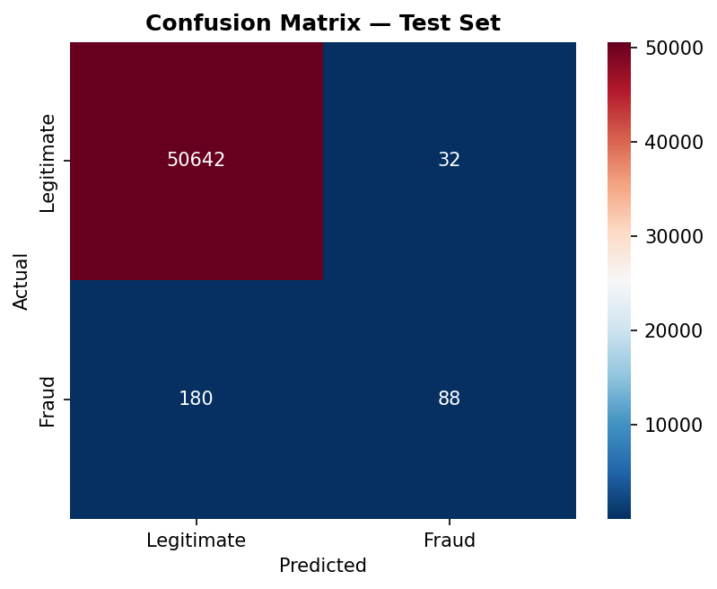
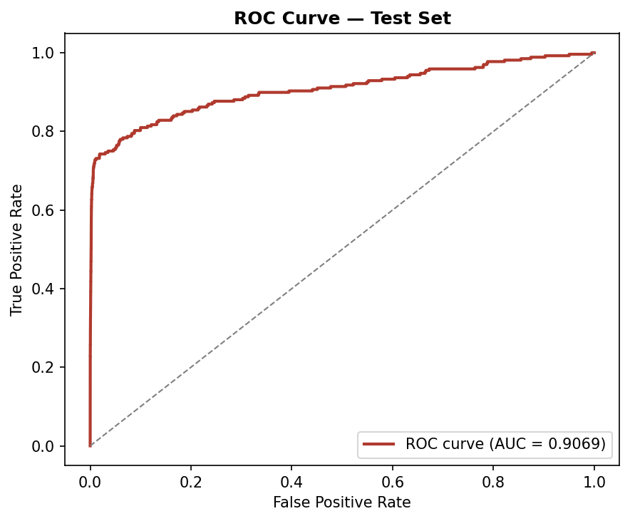
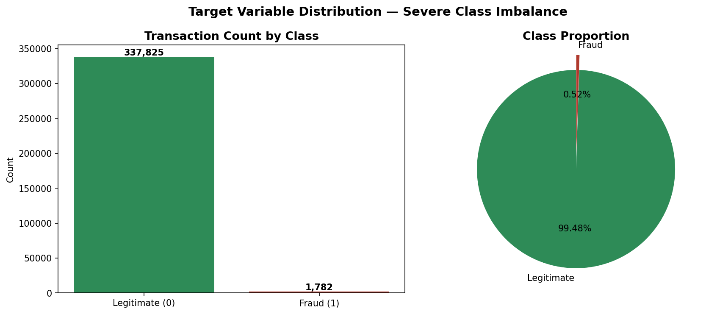
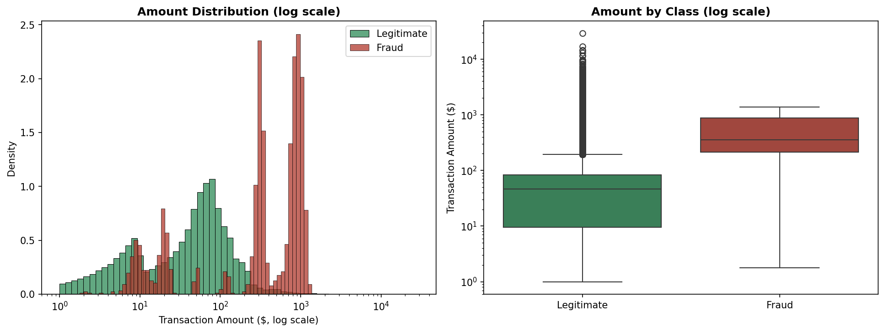
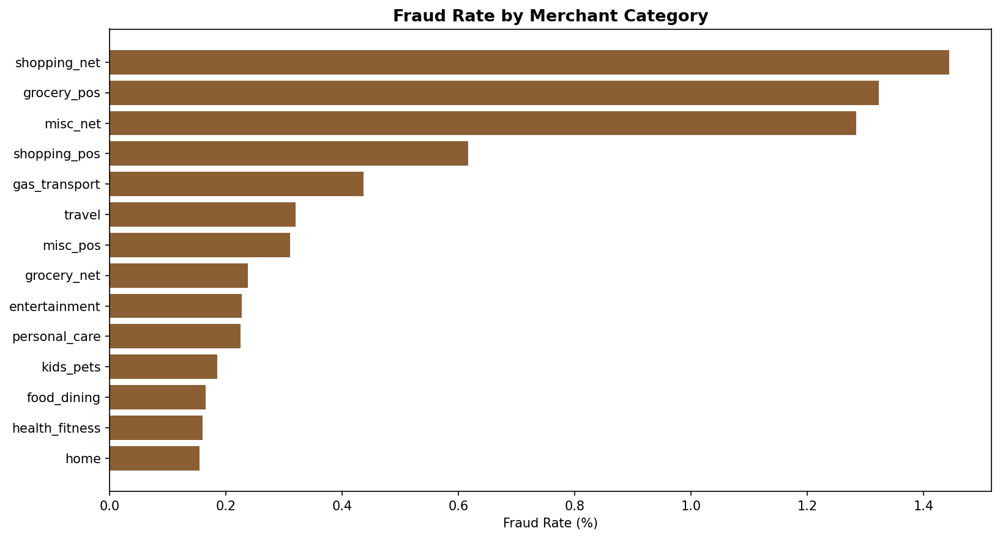
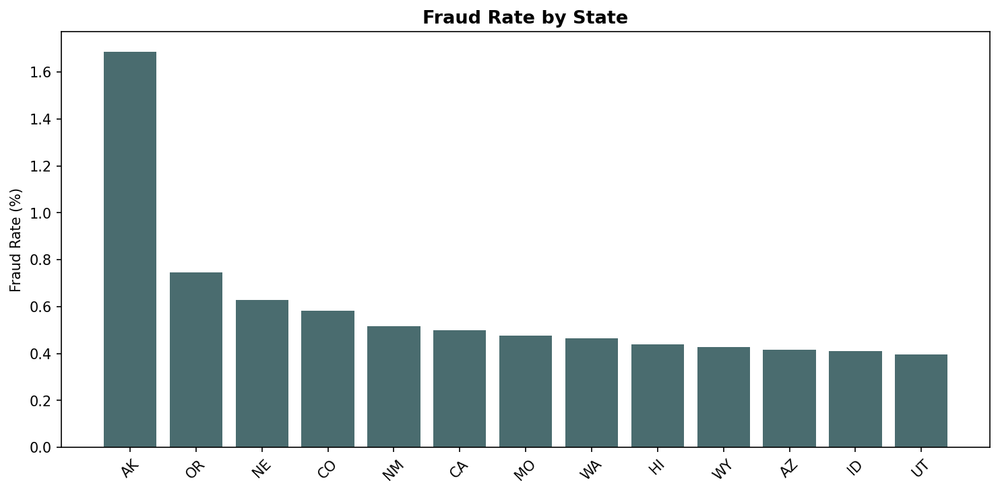
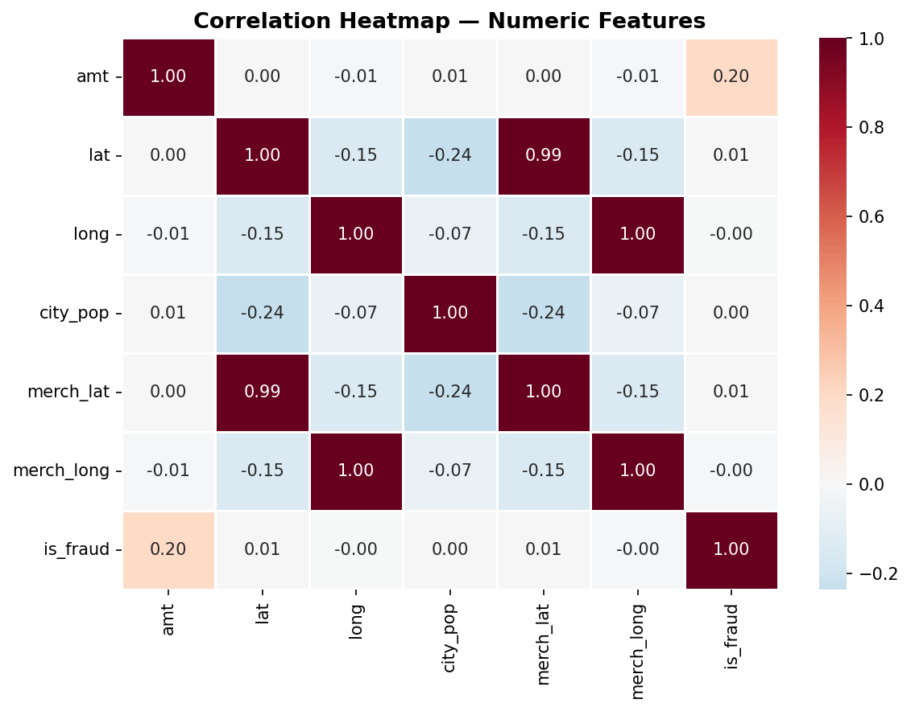

<div align="center">

# Fraud Sentinel
### Credit Card Fraud Detection · PyTorch Neural Network


[](https://www.python.org/)
[](https://pytorch.org/)
[](https://streamlit.io/)
[](https://credit-card-fraud-detection-pytorch.streamlit.app/)

</div>

<br/>

> [!IMPORTANT]
> **Use case:** Fraud Sentinel takes a single card transaction — merchant, amount, category, location, cardholder job, distance between customer and merchant — and returns a real-time fraud probability, so a risk team (or a curious reviewer) can see exactly how a neural network scores risk on unseen transactions.
>
> **Live demo →** **[credit-card-fraud-detection-pytorch.streamlit.app](https://credit-card-fraud-detection-pytorch.streamlit.app/)**

<br/>

<div align="center">
<table>
<tr>
<td width="50%" align="center"><br/><sub>Confusion matrix — test set</sub></td>
<td width="50%" align="center"><br/><sub>ROC curve — AUC 0.907</sub></td>
</tr>
</table>
</div>

---

## Table of Contents

- [Overview](#overview)
- [Dataset](#dataset)
- [Exploratory Data Analysis](#exploratory-data-analysis)
- [Model](#model)
- [Results](#results)
- [Project Structure](#project-structure)
- [Running It](#running-it)
- [Tech Stack](#tech-stack)
- [Future Improvements](#future-improvements)
- [Disclaimer](#disclaimer)

---

## Overview

Card fraud is a needle-in-a-haystack problem — in this dataset, fraudulent transactions make up **just 0.52%** of the data. Fraud Sentinel is a feed-forward neural network trained end-to-end in PyTorch to separate that needle from the haystack, wrapped in a dark, data-dense Streamlit app that scores transactions live and reports the model's own performance honestly, imbalance and all.

**Task type:** Binary classification — `is_fraud` (1 = fraudulent, 0 = legitimate)

---

## Dataset

| | |
|---|---|
| **Rows** | ~254,700 transactions |
| **Target** | `is_fraud` — 1 = fraud, 0 = legitimate |
| **Class balance** | ~0.52% fraud vs ~99.48% legitimate — heavily imbalanced |
| **Quality** | No null values, no duplicate rows |

**Features used (11):** `merchant`, `category`, `amt`, `city`, `state`, `lat`, `long`, `city_pop`, `job`, `merch_lat`, `merch_long`

Categorical fields (merchant, category, city, state, job) are encoded and numeric fields are scaled before hitting the network — the same pipeline is reused at inference time in `app.py`, so the live app scores transactions identically to how the model was trained.

---

## Exploratory Data Analysis

<div align="center">
<table>
<tr>
<td align="center"><br/><sub>Target distribution</sub></td>
<td align="center"><br/><sub>Transaction amount distribution</sub></td>
</tr>
<tr>
<td align="center"><br/><sub>Fraud rate by merchant category</sub></td>
<td align="center"><br/><sub>Fraud rate by state</sub></td>
</tr>
</table>

<br/><sub>Correlation heatmap</sub>
</div>

<details>
<summary><strong>Key EDA takeaways</strong></summary>
<br/>

- Fraud is an extreme minority class (0.52%) — accuracy alone is a misleading headline metric.
- Certain merchant categories and states show a visibly higher fraud rate than others, which the network picks up on through the encoded `category` and `state` features.
- No missing values or duplicates meant cleaning was minimal; the real work was handling the class imbalance downstream.

Full walkthrough with narrative: `notebooks/Credit Card Fraud Detection.ipynb`.

</details>

---

## Model

A compact feed-forward ANN (PyTorch `nn.Module`):

```
Input (11 features)
      │
 Linear(11 → 16)  →  ReLU
      │
 Linear(16 → 8)   →  ReLU
      │
 Linear(8 → 1)    →  raw logit
```

| | |
|---|---|
| **Loss** | `BCEWithLogitsLoss` |
| **Optimizer** | Adam, lr = 0.001 |
| **Epochs** | 10 |
| **Decision threshold** | 0.5 (adjustable live in the app) |

---

## Results

**Test set:** 50,942 transactions (268 fraud · 50,674 legitimate)

| Metric | Legitimate | Fraud |
|---|:---:|:---:|
| Precision | 99.65% | 73.33% |
| Recall | 99.94% | 32.84% |
| F1-score | 99.79% | 45.36% |

<div align="center">

**Accuracy: 99.58%** &nbsp;·&nbsp; **ROC-AUC: 0.907**

</div>

> [!NOTE]
> Accuracy is not the metric that matters here — with fraud at 0.52% of the data, a model that predicts "legitimate" for everything already scores ~99.47%. The honest read is **fraud recall (32.8%)**, **fraud precision (73.3%)**, and **ROC-AUC (0.91)**.
>
> At the default 0.5 threshold the model catches roughly **1 in 3** fraud cases — the network was trained with a plain `BCEWithLogitsLoss` (no `pos_weight`) on data that's ~189:1 imbalanced, so the loss is dominated by the majority class. The ROC-AUC of 0.91 shows the model *has* learned real separation between fraud and legitimate transactions; it's the fixed decision threshold that's costing recall. A lower threshold (e.g. 0.15–0.3) trades precision for recall — usually the right call in real fraud detection, since a missed fraud costs far more than a manual review of a false positive. The Streamlit app exposes this threshold as an adjustable slider so you can see that trade-off yourself.

---

## Project Structure

```
Credit Card Fraud Detection/
│
├── app.py                  # Full app — UI + model + prediction logic, one file
├── requirements.txt        # Dependencies
├── .streamlit/config.toml  # Dark theme
├── data/                   # Cleaned dataset
├── models/                 # Trained model + preprocessing artifacts
├── images/                 # EDA & evaluation charts (used by the app's Analytics/Performance pages)
├── notebooks/               # Full training notebook — EDA + training + evaluation
└── README.md
```

---

## Running It

**Locally:**
```bash
pip install -r requirements.txt
streamlit run app.py
```

**Deploy (Streamlit Community Cloud):**
1. Push this folder to a GitHub repo
2. Go to [share.streamlit.io](https://share.streamlit.io) → New app
3. Point it at the repo/branch, set the main file to `app.py`
4. Deploy — `requirements.txt` and `.streamlit/config.toml` are already set up

---

## Tech Stack


---

## Future Improvements

- [ ] Add `pos_weight` (or focal loss) to `BCEWithLogitsLoss` to directly address the 189:1 class imbalance
- [ ] Make the decision threshold data-driven (e.g. optimize for a target recall) instead of a manual slider default
- [ ] Add SHAP-based explainability so each flagged transaction shows *why* it was flagged
- [ ] Try a tree-based baseline (XGBoost/LightGBM) as a sanity-check comparison against the ANN

---

## Disclaimer

> [!WARNING]
> Portfolio project — not a certified or production-grade fraud-detection system. Predictions should not be used to make real financial decisions.

---

<div align="center">

### Connect

[](https://github.com/Rohit-coder-py)
[](https://www.linkedin.com/in/rohit-jha-ai/)

</div>
