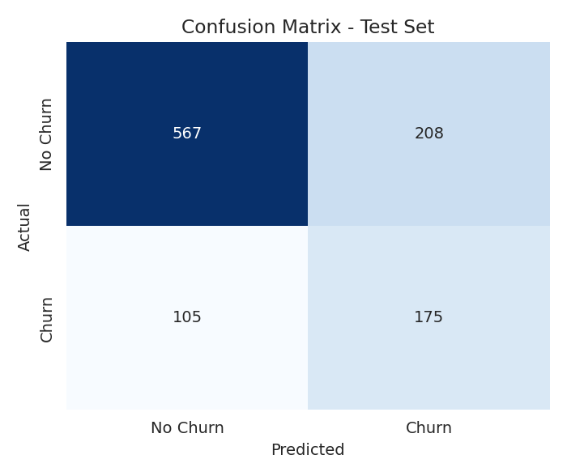
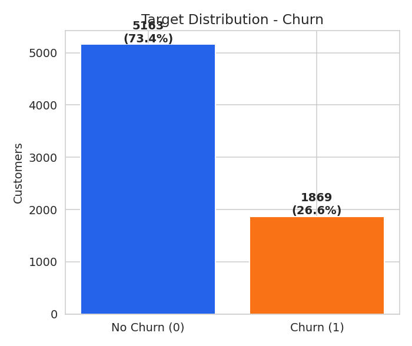
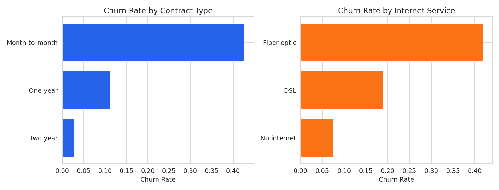
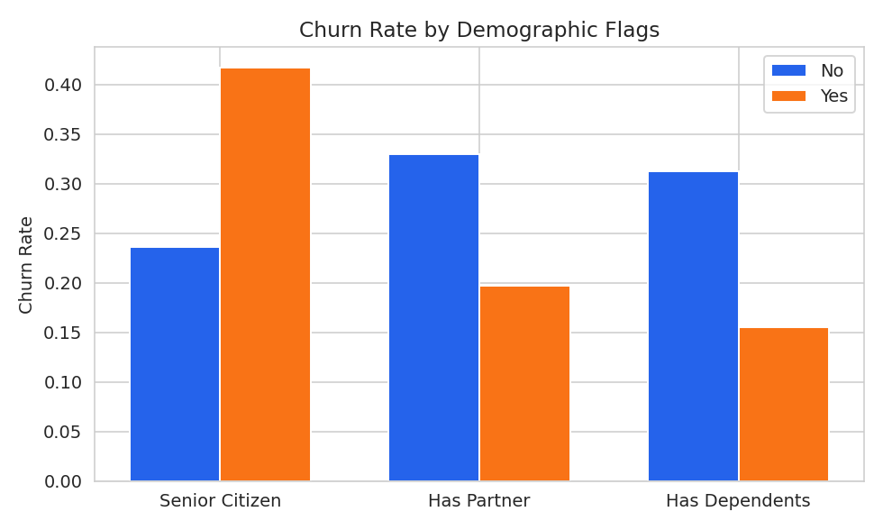

<div align="center">

# Customer Churn Prediction
### Telecom Retention Modeling · PyTorch Neural Network


[](https://www.python.org/)
[](https://pytorch.org/)
[](https://streamlit.io/)
[](https://customer-churn-prediction-pytorch.streamlit.app/)

</div>

<br/>

> [!IMPORTANT]
> **Use case:** Enter a customer's account details — contract type, tenure, services signed up for, monthly charges — and get an instant churn-risk score, so a retention team could, in principle, flag at-risk customers and step in *before* they cancel instead of after.
>
> **Live demo →** **[customer-churn-prediction-pytorch.streamlit.app](https://customer-churn-prediction-pytorch.streamlit.app/)**

<br/>

<div align="center">
<table>
<tr>
<td width="50%" align="center"><br/><sub>Confusion matrix — test set</sub></td>
<td width="50%" align="center"><br/><sub>ROC curve — AUC 0.747</sub></td>
</tr>
</table>
</div>

---

## Table of Contents

- [Overview](#overview)
- [Business Problem](#business-problem)
- [Dataset](#dataset)
- [Exploratory Data Analysis](#exploratory-data-analysis)
- [Model](#model)
- [Results](#results)
- [Project Structure](#project-structure)
- [Running It](#running-it)
- [Tech Stack](#tech-stack)
- [Future Improvements](#future-improvements)
- [Disclaimer](#disclaimer)

---

## Overview

An end-to-end deep learning project that predicts whether a telecom customer is going to **churn** (cancel their subscription), using a PyTorch Artificial Neural Network trained on the classic Telco Customer Churn dataset — shipped with a light, clean Streamlit app for live scoring.

**Task type:** Binary classification — `Churn` (1 = churns, 0 = stays)

---

## Business Problem

Acquiring a new customer costs a lot more than keeping an existing one. This project builds a model that flags customers likely to churn based on their account details, contract type, and the services they've signed up for — so retention teams could step in before the customer leaves.

---

## Dataset

| | |
|---|---|
| **Source** | Telco Customer Churn dataset (`Telco-Customer-Churn.csv`) |
| **Rows** | ~7,032 (after dropping rows with missing `TotalCharges`) |
| **Features** | 19 |
| **Class balance** | ~73% stay vs ~27% churn — imbalanced, handled with a `pos_weight` term in the loss |

**Features used:** `gender`, `SeniorCitizen`, `Partner`, `Dependents`, `tenure`, `PhoneService`, `MultipleLines`, `InternetService`, `OnlineSecurity`, `OnlineBackup`, `DeviceProtection`, `TechSupport`, `StreamingTV`, `StreamingMovies`, `Contract`, `PaperlessBilling`, `PaymentMethod`, `MonthlyCharges`, `TotalCharges`

`customerID` was dropped — a pure identifier with no predictive value.

---

## Exploratory Data Analysis

<div align="center">
<table>
<tr>
<td align="center"><br/><sub>Churn distribution</sub></td>
<td align="center"><br/><sub>Numeric feature distributions</sub></td>
</tr>
<tr>
<td align="center"><br/><sub>Churn rate by category</sub></td>
<td align="center"><br/><sub>Churn rate by demographic</sub></td>
</tr>
</table>

<br/><sub>Correlation heatmap</sub>
</div>

<details>
<summary><strong>Key EDA takeaways</strong></summary>
<br/>

- The dataset is imbalanced (~27% churn), so accuracy alone is a misleading metric — precision, recall, F1, and ROC-AUC are tracked too.
- `tenure` is the strongest signal: customers who churn tend to have been around for a much shorter time.
- `MonthlyCharges` skews higher for churners; `TotalCharges` skews lower — they leave before charges add up.
- `Month-to-month` contracts churn far more than one- or two-year contracts — no lock-in makes it easy to leave.
- `Fiber optic` internet customers churn more than DSL customers.

Full walkthrough: `notebooks/Customer Churn Prediction.ipynb`.

</details>

---

## Model

A feed-forward ANN (PyTorch `nn.Module`):

```
Input (19 features)
      │
 Linear(→ 64)  →  ReLU
      │
 Linear(64 → 32)  →  ReLU
      │
 Linear(32 → 16)  →  ReLU
      │
 Linear(16 → 1)   →  raw logit
```

| | |
|---|---|
| **Loss** | `BCEWithLogitsLoss` with a `pos_weight` term to correct for class imbalance |
| **Optimizer** | Adam, lr = 1e-3 |
| **Batch size** | 64 |

---

## Results

**Test set:** 1,055 rows (held-out)

| Metric | Score |
|---|:---:|
| Accuracy | 70.3% |
| Precision | 45.7% |
| Recall | 62.5% |
| F1 Score | 52.8% |
| ROC-AUC | 0.747 |

> [!NOTE]
> These numbers come from the reference training run shipped with this repo (`models/metrics.json`) — re-run `python src/train.py` (or the notebook) to reproduce or improve on them. Recall on churners matters more than raw accuracy here, since the cost of missing a churner is higher than the cost of a false alarm — that's the main lever for future tuning (see below).

---

## Project Structure

```
Customer Churn Prediction/
│
├── data/
│   └── cleaned_and_scaled_dataset.csv   # Encoded dataset (pre-scaling)
├── notebooks/
│   └── Customer Churn Prediction.ipynb  # Full walkthrough: EDA → encoding → training → saving
├── src/
│   ├── model.py                         # PyTorch ANN architecture
│   ├── preprocessing.py                 # Turns one raw form input into a model-ready row
│   ├── train.py                         # Full training pipeline — run this to retrain
│   └── infer.py                         # Loads saved artifacts + predict() used by the app
├── models/
│   ├── churn_model_weights.npz          # Trained weights
│   ├── scaler.pkl                       # Fitted StandardScaler
│   ├── feature_order.pkl                # Exact feature column order
│   └── metrics.json                     # Test-set metrics
├── images/                              # Saved EDA + evaluation plots
├── app.py                               # Streamlit inference UI (light theme)
├── requirements.txt
└── README.md
```

---

## Running It

**Retrain from scratch:**
```bash
pip install -r requirements.txt
python src/train.py
```

**Launch the app:**
```bash
streamlit run app.py
```

The app ships with an already-trained model in `models/`, so it works right away — retraining is optional.

**Deploy (Streamlit Community Cloud):** push this repo to GitHub and point Streamlit Community Cloud at `app.py` as the entry file. The `.streamlit/config.toml` pins a light theme so the app never renders dark, regardless of the visitor's system settings.

---

## Tech Stack


---

## Future Improvements

- [ ] Try tree-based baselines (XGBoost/LightGBM) as a sanity-check comparison against the ANN
- [ ] Add SHAP-based feature importance / explainability to the app
- [ ] k-fold cross-validation instead of a single train/valid/test split, for a more robust performance estimate
- [ ] Tune the classification threshold instead of the default 0.5, since recall on churners matters more than raw accuracy here

---

## Disclaimer

> [!WARNING]
> This model is a screening tool built for a data science portfolio, not a production-grade retention system. Predictions should be treated as a starting point for a human decision, not a final verdict on any customer.

---

<div align="center">

### Connect

[](https://github.com/Rohit-coder-py)
[](https://www.linkedin.com/in/rohit-jha-ai/)

</div>
