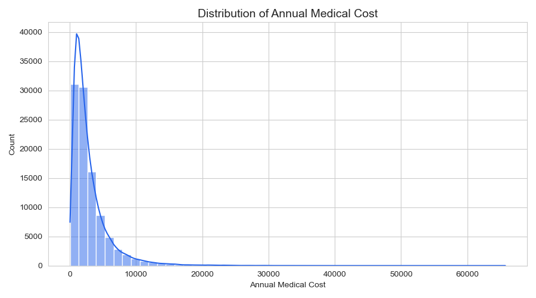
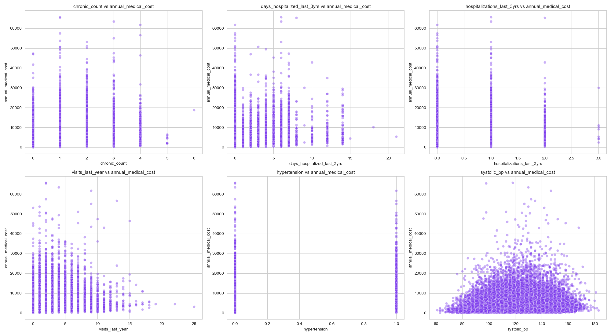
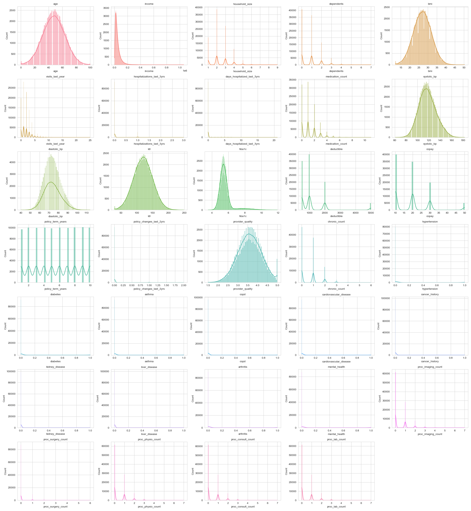
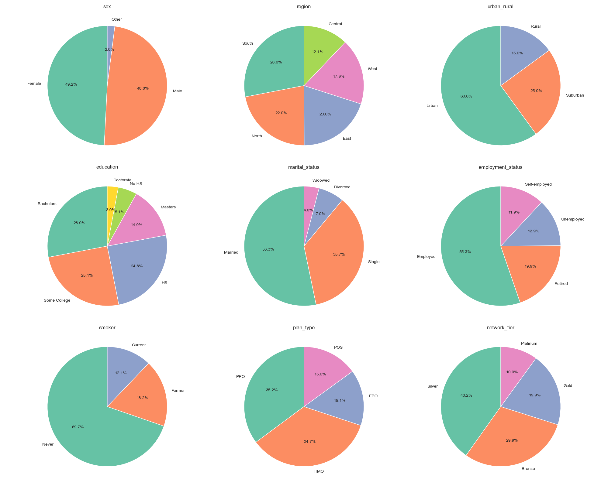
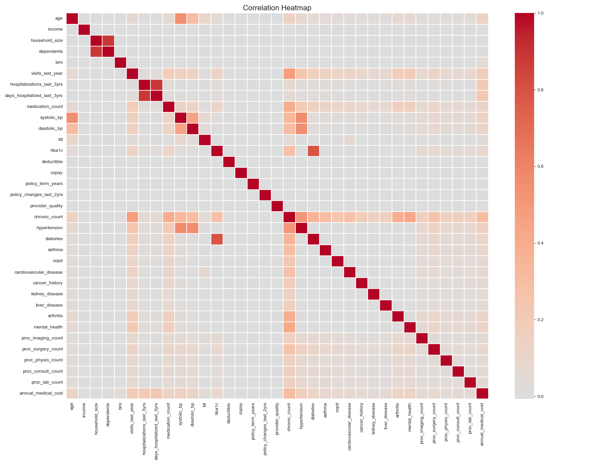

<div align="center">

# Medical Insurance Cost Predictor
### Annual Medical Cost Estimation · PyTorch Neural Network


[](https://www.python.org/)
[](https://pytorch.org/)
[](https://streamlit.io/)
[]()

</div>

<br/>

> [!IMPORTANT]
> **Use case:** Enter a person's demographics, income, lifestyle, and clinical/health history — age, BMI, smoking status, chronic conditions, hospitalizations, blood pressure, plan type — and get an instant estimate of their **annual medical cost**, the way an underwriting or actuarial team might use a first-pass model to sanity-check a quote.
>
> **Live demo → <mark>https://medical-insurance-cost-predictor-pytorch.streamlit.app/</mark>
<br/>

<div align="center">
<table>
<tr>
<td width="50%" align="center"><br/><sub>Target distribution — annual medical cost</sub></td>
<td width="50%" align="center"><br/><sub>Top correlated features vs. target</sub></td>
</tr>
</table>
</div>

---

## Table of Contents

- [Overview](#overview)
- [Dataset](#dataset)
- [Exploratory Data Analysis](#exploratory-data-analysis)
- [Model](#model)
- [Results](#results)
- [Project Structure](#project-structure)
- [Running It](#running-it)
- [Tech Stack](#tech-stack)
- [Future Improvements](#future-improvements)
- [Disclaimer](#disclaimer)

---

## Overview

A feed-forward neural network trained end-to-end in PyTorch to **predict a continuous dollar value** — a person's annual medical cost — from their demographic, lifestyle, and clinical profile. Unlike the other ANN projects in this portfolio, this is a **regression** problem, not a classifier: the model outputs a single number, not a probability.

**Task type:** Regression — `annual_medical_cost` (continuous, USD)

---

## Dataset

| | |
|---|---|
| **Rows** | 100,000 synthetic policyholder records |
| **Raw columns** | 54 |
| **Target** | `annual_medical_cost` — mean ≈ $3,009, std ≈ $3,127, range $55.55–$65,724.90 |

**Leakage columns dropped before modelling:** `annual_premium`, `monthly_premium`, `claims_count`, `avg_claim_amount`, `total_claims_paid`, `risk_score`, `is_high_risk`, `had_major_procedure` — all of these are derived from the same billing/claims process as the target itself (some correlate with it at **>0.9**), so keeping any of them would let the model see the answer. `person_id` (a pure identifier) and `alcohol_freq` (~30% missing) were dropped too.

**What's left — 34 numeric + 9 categorical features**, covering:

| Group | Examples |
|---|---|
| Demographic | `age`, `sex`, `region`, `urban_rural`, `income`, `education`, `marital_status`, `employment_status`, `household_size`, `dependents` |
| Lifestyle | `bmi`, `smoker`, `visits_last_year` |
| Clinical history | `hospitalizations_last_3yrs`, `days_hospitalized_last_3yrs`, `medication_count`, `systolic_bp`, `diastolic_bp`, `ldl`, `hba1c` |
| Chronic conditions | `chronic_count`, `hypertension`, `diabetes`, `asthma`, `copd`, `cardiovascular_disease`, `cancer_history`, `kidney_disease`, `liver_disease`, `arthritis`, `mental_health` |
| Plan details | `plan_type`, `network_tier`, `deductible`, `copay`, `policy_term_years`, `policy_changes_last_2yrs`, `provider_quality` |
| Procedures | `proc_imaging_count`, `proc_surgery_count`, `proc_physio_count`, `proc_consult_count`, `proc_lab_count` |

Categorical columns are one-hot encoded and numeric columns are standard-scaled before hitting the network.

---

## Exploratory Data Analysis

<div align="center">
<table>
<tr>
<td align="center"><br/><sub>Numerical feature distributions</sub></td>
<td align="center"><br/><sub>Categorical feature breakdown</sub></td>
</tr>
</table>

<br/><sub>Correlation heatmap</sub>
</div>

<details>
<summary><strong>Key EDA takeaways</strong></summary>
<br/>

- After removing the leakage columns, **`chronic_count` (0.30), `days_hospitalized_last_3yrs` (0.23), `hospitalizations_last_3yrs` (0.21), `visits_last_year` (0.20), `hypertension` (0.15), `systolic_bp` (0.15)** and `age` (0.13) are the strongest legitimate predictors of annual medical cost — but all of these correlations are fairly weak on their own.
- `annual_medical_cost` is right-skewed: most policyholders cluster in the low thousands, with a long tail of high-cost outliers driven by chronic conditions and hospitalizations.
- No single feature dominates — cost here is genuinely a function of many small, weak signals combined, which is part of why this is a harder regression problem than it first looks.

Full walkthrough with narrative: `notebooks/Medical Insurance Cost Prediction.ipynb`.

</details>

---

## Model

A feed-forward ANN (PyTorch `nn.Module`):

```
Input (34 numeric + one-hot encoded categorical features)
      │
 Linear(→ 128)  →  ReLU  →  Dropout(0.2)
      │
 Linear(128 → 64)  →  ReLU  →  Dropout(0.2)
      │
 Linear(64 → 32)   →  ReLU
      │
 Linear(32 → 1)    →  predicted cost
```

| | |
|---|---|
| **Loss** | `MSELoss` |
| **Optimizer** | Adam, lr = 0.001 |
| **Batch size / epochs** | 64 / 100 |
| **Split** | 70% train · 15% validation · 15% test |

---

## Results

**Test set:** 15,000 held-out records

| Metric | Score |
|---|:---:|
| MAE | $1,787.42 |
| RMSE | $2,920.70 |
| R² | 0.168 |

> [!NOTE]
> The R² of 0.17 is a genuinely honest result, not a bug — once the leakage columns (premium, claims, risk score) are removed, what's left are demographic and clinical features whose correlation with actual cost tops out around 0.30. Real-world medical cost is driven heavily by the specific procedures and claims a person ends up needing in a given year, which this feature set only weakly proxies through history and chronic-condition flags. An MAE of ~$1,787 against a mean cost of ~$3,009 means predictions are a rough directional estimate, not a precise quote — treat this model's output as a starting point for further underwriting judgment, not a final number.

---

## Project Structure

```
Medical Insurance Cost Predictor ANN/
│
├── app.py                    # Streamlit inference UI
├── requirements.txt          # Dependencies
├── data/
│   └── medical_insurance_cost.csv
├── notebooks/
│   └── Medical Insurance Cost Prediction.ipynb   # Full walkthrough: EDA → encoding → training → evaluation
├── src/
│   ├── model.py               # PyTorch ANN architecture (InsuranceANN)
│   ├── preprocessing.py       # Cleaning, leakage-column removal, encoding, scaling
│   ├── train.py                # Full training pipeline — run this to retrain
│   └── inference.py            # Loads saved artifacts + predict() used by the app
├── models/
│   └── medical_insurance_ann.pth   # Trained weights
├── artifacts/
│   ├── encoder.pkl             # Fitted OneHotEncoder
│   ├── scaler.pkl              # Fitted StandardScaler
│   └── feature_order.pkl       # Exact feature column order + numeric/categorical split
├── images/                    # Saved EDA plots
└── README.md
```

---

## Running It

**Retrain from scratch:**
```bash
pip install -r requirements.txt
python src/train.py
```

**Launch the app:**
```bash
streamlit run app.py
```

The app ships with an already-trained model in `models/`, so it works right away — retraining is optional.

**Deploy (Streamlit Community Cloud):**
1. Push this folder to a GitHub repo
2. Go to [share.streamlit.io](https://share.streamlit.io) → New app
3. Point it at the repo/branch, set the main file to `app.py`
4. Deploy, then drop the live link into this README

---

## Tech Stack


---

## Future Improvements

- [ ] Try tree-based baselines (XGBoost/LightGBM, Random Forest) — regression trees often handle this kind of weak, non-linear, many-feature relationship better than a plain ANN
- [ ] Add engineered interaction features (e.g. `chronic_count × age`, `bmi × smoker`) to give the network more to work with
- [ ] Log-transform the right-skewed target before training, which usually helps MSE-based regression on cost/price data
- [ ] Add a prediction-interval or confidence band to the app output instead of a single point estimate, given the current R²

---

## Disclaimer

> [!WARNING]
> Portfolio project — not a certified actuarial or underwriting tool. Predictions are a rough estimate for demonstration purposes and should never be used to set real insurance pricing or make coverage decisions.

---

<div align="center">

### Connect

[](https://github.com/Rohit-coder-py)
[](https://www.linkedin.com/in/rohit-jha-ai/)

</div>
