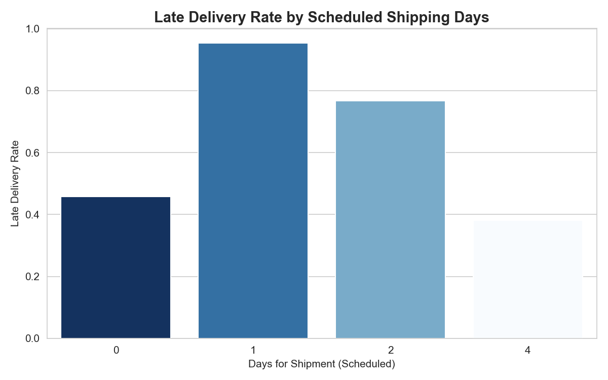
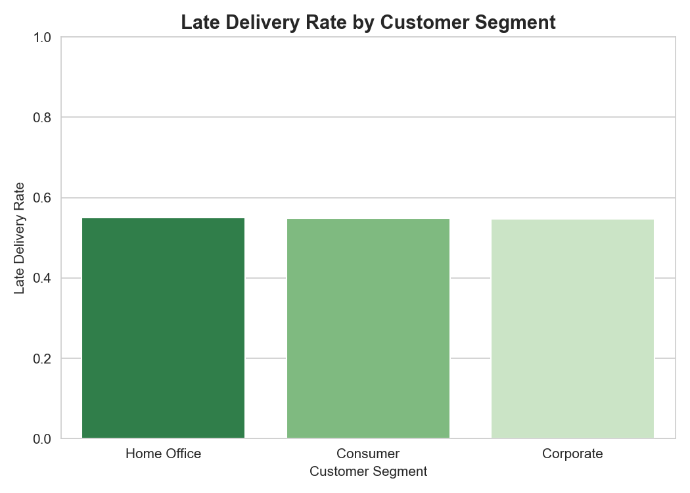
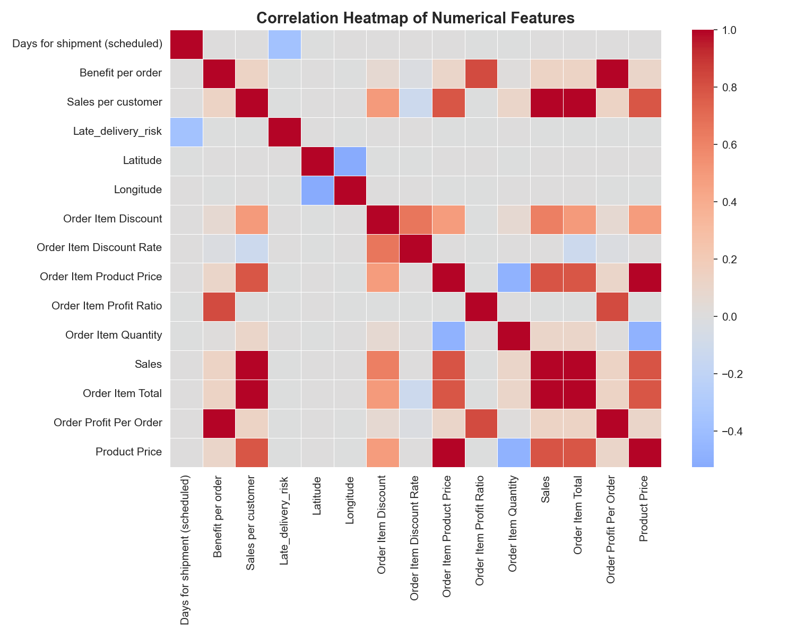

<div align="center">

# ShipSense
### Late Delivery Risk Predictor · PyTorch Neural Network


[](https://www.python.org/)
[](https://pytorch.org/)
[](https://streamlit.io/)
[](https://optuna.org/)
[]()

</div>

<br/>

> [!IMPORTANT]
> **Use case:** Enter an order's shipping mode, scheduled delivery window, customer segment, region, and order economics, and get an instant late-delivery-risk prediction — so a logistics/ops team could flag high-risk shipments before they go out, instead of finding out after the delivery window is already blown.
>
> **Live demo →** *deploying now — link will be added here shortly*

<br/>

<div align="center">
<table>
<tr>
<td width="50%" align="center"><br/><sub>Late-delivery risk distribution</sub></td>
<td width="50%" align="center"><br/><sub>Risk by shipping mode</sub></td>
</tr>
</table>
</div>

---

## Table of Contents

- [Overview](#overview)
- [Dataset](#dataset)
- [Exploratory Data Analysis](#exploratory-data-analysis)
- [Model](#model)
- [Results](#results)
- [Project Structure](#project-structure)
- [Running It](#running-it)
- [Tech Stack](#tech-stack)
- [Future Improvements](#future-improvements)
- [Disclaimer](#disclaimer)

---

## Overview

ShipSense is a feed-forward neural network that predicts whether an order is at risk of a **late delivery**, trained on order, product, customer, and shipping data from a large e-commerce/logistics dataset. Hyperparameters were tuned with Optuna over multiple trials before locking in the final architecture, and the app scores new shipments through the same encode → scale → predict pipeline used at training time.

**Task type:** Binary classification — `Late_delivery_risk` (1 = at risk of late delivery, 0 = no risk)

---

## Dataset

| | |
|---|---|
| **Rows** | ~180,000+ orders |
| **Target** | `Late_delivery_risk` — 1 = late-delivery risk, 0 = no risk |
| **Class balance** | ~54.8% risk vs ~45.2% no risk — fairly balanced, no resampling needed |

**Features (27):** payment `Type`, `Days for shipment (scheduled)`, `Benefit per order`, `Sales per customer`, `Category Name`, `Customer City/Country/Segment/State`, `Department Name`, `Latitude`/`Longitude`, `Market`, `Order City/Country/Region/State`, `Order Item Discount`(+ `Rate`), `Order Item Product Price`, `Order Item Profit Ratio`, `Order Item Quantity`, `Sales`, `Order Item Total`, `Order Profit Per Order`, `Product Price`, `Shipping Mode`

Categorical columns are ordinal-encoded and every column is standard-scaled before the network sees it — the Streamlit app rebuilds a single-row DataFrame from the form and runs it through the exact same encoder/scaler saved from training.

---

## Exploratory Data Analysis

<div align="center">
<table>
<tr>
<td align="center"><br/><sub>Scheduled shipping days vs. risk</sub></td>
<td align="center"><br/><sub>Risk by customer segment</sub></td>
</tr>
<tr>
<td align="center" colspan="2"><br/><sub>Risk by order region</sub></td>
</tr>
</table>

<br/><sub>Correlation heatmap</sub>
</div>

<details>
<summary><strong>Key EDA takeaways</strong></summary>
<br/>

- Classes are fairly balanced (54.8% risk vs 45.2% no risk), so accuracy is a reasonably trustworthy metric here — no oversampling/undersampling needed.
- **Shipping Mode is the single biggest driver of risk.** `First Class` orders are late **95.3%** of the time, `Second Class` **76.6%**, while `Standard Class` is only late **38.1%** of the time — a tighter promised delivery window leaves far less slack to absorb delays.
- Customer segment and order region add secondary signal on top of shipping mode.

Full walkthrough with narrative: `notebooks/ShipSense - Deep Learning.ipynb`.

</details>

---

## Model

A feed-forward ANN (PyTorch `nn.Module`), architecture chosen via Optuna hyperparameter search:

```
Input (27 features)
      │
 Linear(→ 64)  →  ReLU  →  Dropout(0.0)
      │
 Linear(64 → 32)  →  ReLU  →  Dropout(0.0)
      │
 Linear(32 → 8)   →  ReLU  →  Dropout(0.0)
      │
 Linear(8 → 1)    →  raw logit
```

| | |
|---|---|
| **Loss** | `BCEWithLogitsLoss` |
| **Optimizer** | Adam, lr ≈ 8.6e-4 (Optuna-tuned) |
| **Batch size** | 256 |
| **Tuning** | Optuna search over hidden-layer sizes, dropout, learning rate, and batch size (best validation F1: 0.679) |

---

## Results

**Test set:** 27,078 orders

| Metric | Score |
|---|:---:|
| Accuracy | 69.9% |
| Precision | 82.3% |
| Recall | 57.3% |
| F1 Score | 67.6% |

| | Precision | Recall | F1 | Support |
|---|:---:|:---:|:---:|:---:|
| Not Late | 0.62 | 0.85 | 0.72 | 12,232 |
| Late | 0.82 | 0.57 | 0.68 | 14,846 |

> [!NOTE]
> The model is precision-heavy on the "Late" class — when it predicts a delivery will be late, it's right **82% of the time**, but it still misses a meaningful chunk of the actually-late orders (57% recall). For an ops team, that means the model is a reliable *high-confidence* late-delivery flag, but shouldn't be the only signal used to catch every at-risk shipment.

---

## Project Structure

```
Shipping Delay Prediction System v2/
│
├── app.py                # Streamlit inference UI
├── data/                 # Training data
├── graphs/                # Saved EDA charts
├── models/
│   ├── shipsense_model.pth        # Trained weights
│   ├── scaler.pkl                  # Fitted StandardScaler
│   ├── encoder.pkl                 # Fitted OrdinalEncoder
│   ├── best_hyperparameters.pkl    # Optuna's winning config
│   ├── categorical_columns.pkl     # Which columns are categorical
│   ├── numerical_columns.pkl       # Which columns are numerical
│   └── feature_order.pkl           # Exact feature column order
├── notebooks/
│   └── ShipSense - Deep Learning.ipynb   # Full walkthrough: EDA → Optuna tuning → training → evaluation
├── src/
│   ├── model.py            # PyTorch ANN architecture (OptunaShipSenseModel)
│   ├── preprocessing.py    # Loads scaler/encoder/feature order for inference
│   └── inference.py        # Loads the trained model for the app
└── README.md
```

---

## Running It

**Locally:**
```bash
pip install streamlit pandas torch scikit-learn joblib
streamlit run app.py
```

> [!NOTE]
> This project doesn't yet ship a pinned `requirements.txt` — the command above covers everything `app.py` imports. Pin exact versions before deploying for reproducibility.

**Deploy (Streamlit Community Cloud):**
1. Push this folder to a GitHub repo
2. Go to [share.streamlit.io](https://share.streamlit.io) → New app
3. Point it at the repo/branch, set the main file to `app.py`
4. Deploy, then drop the live link into this README

---

## Tech Stack


---

## Future Improvements

- [ ] Add a pinned `requirements.txt` and `.streamlit/config.toml` for reproducible deploys
- [ ] Push recall up on the "Late" class — try a lower decision threshold or class-weighted loss
- [ ] Add SHAP-based feature importance so a flagged shipment shows *why* it's at risk
- [ ] Try a tree-based baseline (XGBoost/LightGBM) as a sanity-check comparison against the ANN

---

## Disclaimer

> [!WARNING]
> Portfolio project — not a production-grade logistics system. Predictions should be treated as a starting point for a human decision, not a guarantee of delivery outcome.

---

<div align="center">

### Connect

[](https://github.com/Rohit-coder-py)
[](https://www.linkedin.com/in/rohit-jha-ai/)

</div>
