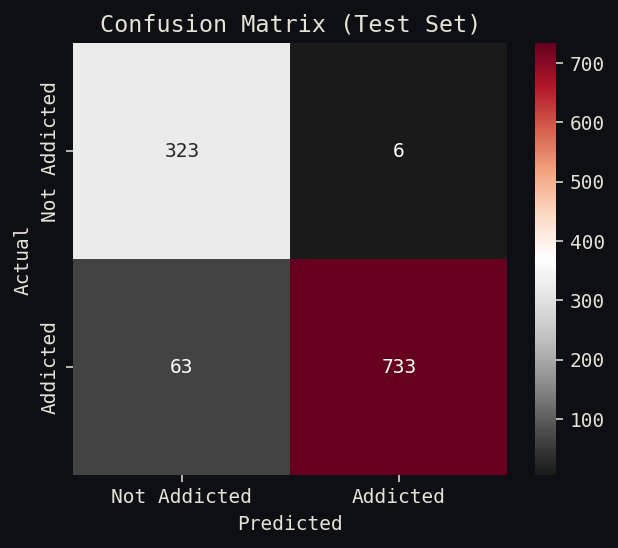
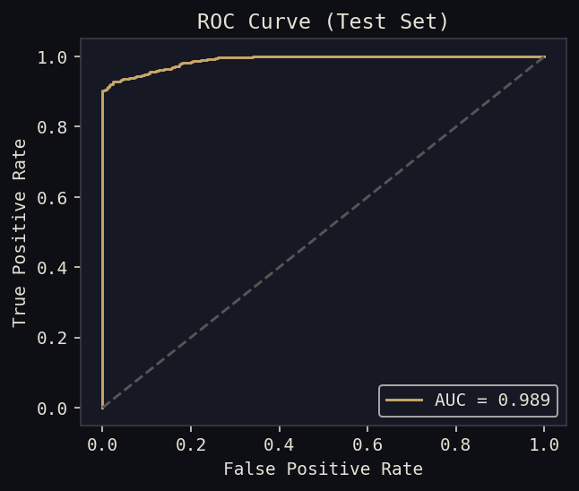
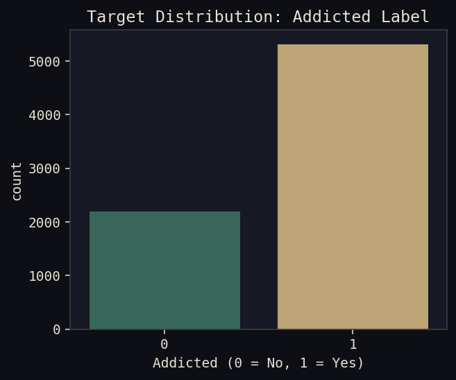
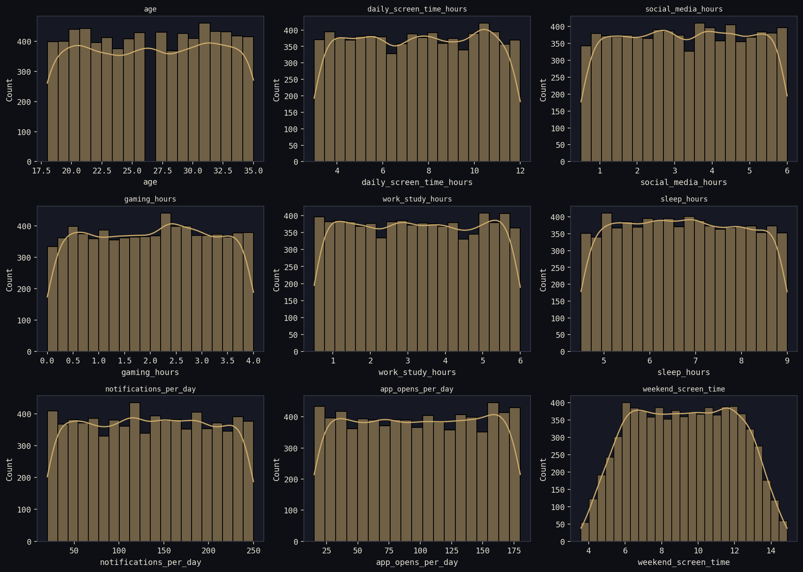
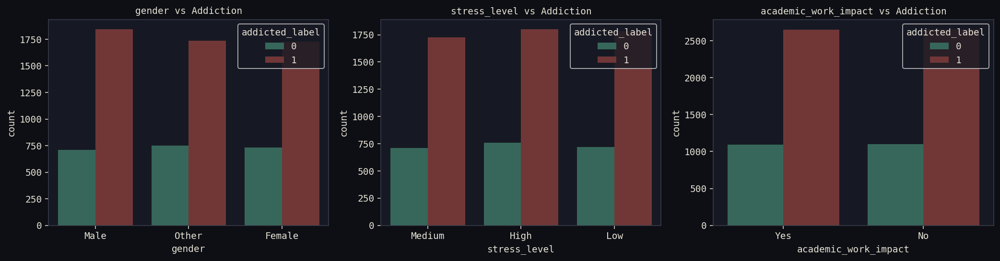
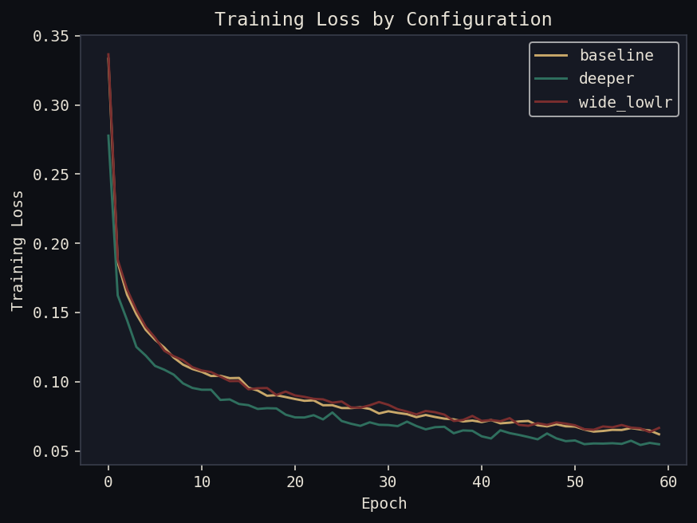
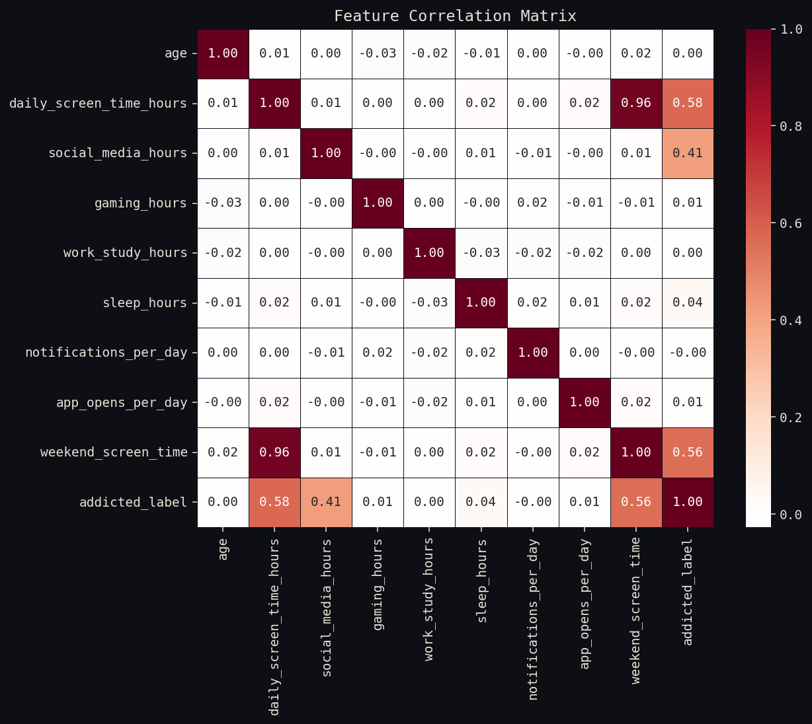

<div align="center">

# Smartphone Usage & Addiction Prediction
### Behavioural Risk Screening · PyTorch Neural Network


[](https://www.python.org/)
[](https://pytorch.org/)
[](https://streamlit.io/)
[]()

</div>

<br/>

> [!IMPORTANT]
> **Use case:** Enter a few self-reportable habits — daily screen time, social media and gaming hours, sleep, notification volume, stress level — and get an instant addictive-usage-risk score, so the risk can be surfaced early from simple inputs instead of after it becomes a problem.
>
> **Live demo →** *link coming soon — will be added once deployed*

<br/>

<div align="center">
<table>
<tr>
<td width="50%" align="center"><br/><sub>Confusion matrix — test set</sub></td>
<td width="50%" align="center"><br/><sub>ROC curve — AUC 0.989</sub></td>
</tr>
</table>
</div>

---

## Table of Contents

- [Overview](#overview)
- [Business Problem](#business-problem)
- [Dataset](#dataset)
- [Exploratory Data Analysis](#exploratory-data-analysis)
- [Model](#model)
- [Results](#results)
- [Project Structure](#project-structure)
- [Running It](#running-it)
- [Tech Stack](#tech-stack)
- [Future Improvements](#future-improvements)
- [Disclaimer](#disclaimer)

---

## Overview

An end-to-end deep learning project that predicts whether a person's smartphone usage pattern qualifies as **addictive**, using a PyTorch Artificial Neural Network trained on behavioural and demographic data — wrapped in a dark Streamlit app for live screening.

**Task type:** Binary classification — `addicted_label` (1 = addictive pattern, 0 = not)

---

## Business Problem

Excessive smartphone use is linked to disrupted sleep, lower academic/work performance, and elevated stress. This project builds a screening model that flags addictive usage risk from simple, self-reportable inputs — screen time, social media hours, sleep, notification volume, stress level, and a few demographics — so the risk can be surfaced early, before it becomes a crisis.

---

## Dataset

| | |
|---|---|
| **Source** | [Kaggle — Smartphone Usage And Addiction Analysis](https://www.kaggle.com/datasets/jayjoshi37/smartphone-usage-and-addiction-prediction) |
| **Rows** | 7,500 |
| **Columns** | 16 |
| **Class balance** | 5,308 addicted (70.8%) vs 2,192 not addicted (29.2%) |

**Features used:**

| Feature | Type | Description |
|---|---|---|
| `age` | numeric | 18–35 |
| `daily_screen_time_hours` | numeric | Total daily screen time |
| `social_media_hours` | numeric | Daily social media use |
| `gaming_hours` | numeric | Daily gaming use |
| `work_study_hours` | numeric | Daily work/study screen use |
| `sleep_hours` | numeric | Daily sleep |
| `notifications_per_day` | numeric | Notification count |
| `app_opens_per_day` | numeric | App-open count |
| `weekend_screen_time` | numeric | Weekend screen time |
| `gender` | categorical | Male / Female / Other |
| `stress_level` | categorical | Low / Medium / High |
| `academic_work_impact` | categorical | Self-reported Yes/No |

> [!CAUTION]
> **Data leakage found and removed:** the raw dataset includes an `addiction_level` column (Mild / Moderate / Severe) that maps *perfectly* onto the target (`Mild → 0`, `Moderate`/`Severe → 1`). Since it's derived directly from the label, it was dropped before modelling — along with `transaction_id` and `user_id`, which are pure identifiers.

---

## Exploratory Data Analysis

<div align="center">
<table>
<tr>
<td align="center"><br/><sub>Target distribution</sub></td>
<td align="center"><br/><sub>Numerical feature distributions</sub></td>
</tr>
<tr>
<td align="center"><br/><sub>Categorical breakdowns vs. target</sub></td>
<td align="center"><br/><sub>Training loss curves</sub></td>
</tr>
</table>

<br/><sub>Correlation heatmap</sub>
</div>

<details>
<summary><strong>Key EDA takeaways</strong></summary>
<br/>

- `social_media_hours` and `daily_screen_time_hours` show the strongest positive relationship with addiction risk.
- `sleep_hours` is negatively correlated — more sleep, lower risk.
- `stress_level = High` and `academic_work_impact = Yes` skew heavily toward the addicted class.
- `gender` is only a weak standalone predictor.

Full walkthrough with narrative: `notebooks/Main.ipynb`.

</details>

---

## Model

A feed-forward ANN (PyTorch `nn.Module`):

```
Input features
      │
 Linear(→ 64)  →  ReLU  →  Dropout(0.2)
      │
 Linear(64 → 32)  →  ReLU  →  Dropout(0.2)
      │
 Linear(32 → 16)  →  ReLU  →  Dropout(0.2)
      │
 Linear(16 → 1)   →  raw logit
```

| | |
|---|---|
| **Loss** | `BCEWithLogitsLoss` with a `pos_weight` term to correct for class imbalance |
| **Optimizer** | Adam, lr = 5e-4 |
| **Batch size / epochs** | 32 / 60 |

Three hyperparameter configurations (`baseline` / `deeper` / `wide_lowlr`) were trained and compared on validation F1 — `wide_lowlr` won and was used for the final saved model.

---

## Results

**Test set:** 1,125 rows (held-out)

| Metric | Score |
|---|:---:|
| Accuracy | 93.9% |
| Precision | 99.2% |
| Recall | 92.1% |
| F1 Score | 95.5% |
| ROC-AUC | 0.989 |

> [!NOTE]
> High precision (99.2%) means the model is rarely wrong when it flags someone as at-risk — the small recall gap (92.1%) is where a handful of genuinely at-risk cases are missed. Confusion matrix and ROC curve above are saved in `images/06_confusion_matrix.png` and `images/07_roc_curve.png`.

---

## Project Structure

```
Smartphone-Addiction-Prediction/
│
├── data/
│   └── Smartphone_Usage_And_Addiction_Analysis_7500_Rows.csv
├── notebooks/
│   └── Main.ipynb              # Full narrative walkthrough, phases 1-19
├── src/
│   ├── preprocessing.py        # Cleaning, encoding, scaling
│   ├── model.py                # PyTorch ANN architecture
│   ├── train.py                # Full training pipeline — run this to retrain
│   └── infer.py                # Loads model + predict() used by the app
├── models/
│   ├── addiction_model.pth     # Trained weights
│   ├── scaler.pkl              # Fitted StandardScaler
│   ├── encoders.pkl            # One-hot column mapping
│   ├── feature_order.pkl       # Exact feature column order
│   └── metrics.json            # Final test-set metrics
├── app/
│   └── app.py                  # Streamlit inference UI
├── images/                     # Saved EDA + evaluation plots
├── requirements.txt
└── README.md
```

---

## Running It

**Retrain from scratch:**
```bash
pip install -r requirements.txt
python src/train.py
```

**Launch the app:**
```bash
streamlit run app/app.py
```

**Deploy:** push this repo to GitHub and point Streamlit Community Cloud at `app/app.py` as the entry file.

---

## Tech Stack


---

## Future Improvements

- [ ] Try tree-based baselines (XGBoost/LightGBM) as a sanity-check comparison against the ANN
- [ ] Add SHAP-based feature importance / explainability to the app
- [ ] Collect more granular time-of-day usage data instead of daily totals
- [ ] k-fold cross-validation instead of a single train/val/test split, for a more robust performance estimate

---

## Disclaimer

> [!WARNING]
> This model is a screening tool built for a data science portfolio, not a clinical or diagnostic instrument. Predictions should not be used to make real decisions about anyone's mental health or wellbeing.

---

<div align="center">

### Connect

[](https://github.com/Rohit-coder-py)
[](https://www.linkedin.com/in/rohit-jha-ai/)

</div>
