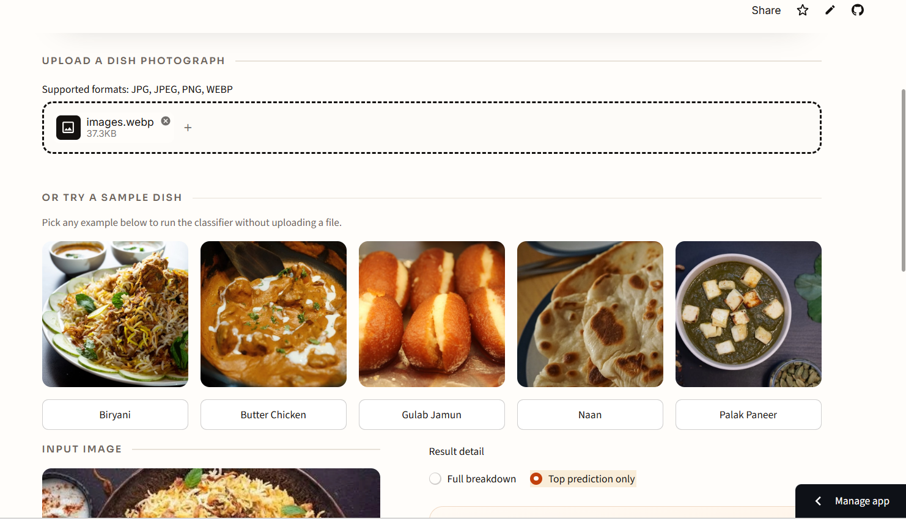
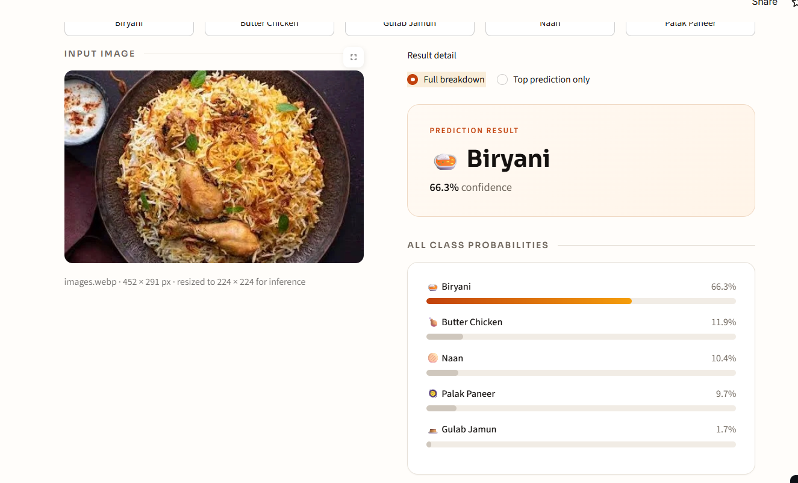

# 🍛 Indian Food Image Classifier

AI-powered Indian food recognition built on **EfficientNet-B0** transfer learning, served through a polished Streamlit interface.

---

## 🎥 Demo Video

https://github.com/user-attachments/assets/bfda6ec6-f2a6-4fb9-8210-23fd15b29670

---

## 🔥 Project Overview

This project classifies photographs of Indian dishes into five food categories using a fine-tuned **EfficientNet-B0** CNN. A pretrained ImageNet backbone was adapted with a custom 5-class head and trained on a curated Indian food dataset. The trained weights ship inside the repo, and `app.py` loads them straight into a Streamlit app for inference — no training, dataset download, or Kaggle credentials required to run it.

## 🎯 Project Goal

Build an end-to-end image classification pipeline — from transfer learning on a real-world food dataset to a deployable, production-quality web app — that can correctly identify a dish from a single uploaded photo and return a confidence-scored prediction.

## 🧠 Model / Architecture

- **Backbone:** `torchvision.models.efficientnet_b0`, pretrained on ImageNet
- **Head:** `classifier[1]` replaced with `nn.Linear(1280, 5)` for the 5 target classes
- **Inference weights:** `models/efficientnet_b0_best.pth` (falls back to `efficientnet_b0_final.pth`)
- **Class mapping:** `models/class_to_idx.json` (falls back to `models/indian_food_class_to_idx.json`)
- **Preprocessing** (identical to the notebook's `eval_transform`):

```python
transforms.Compose([
    transforms.Resize((224, 224)),
    transforms.ToTensor(),
    transforms.Normalize(mean=[0.485, 0.456, 0.406],
                         std=[0.229, 0.224, 0.225]),
])
```

Uploaded images are EXIF-rotated and converted to RGB before this pipeline runs.

### Supported Classes

| Class label       | Display name   |
| ------------------ | -------------- |
| `biryani`           | Biryani        |
| `butter_chicken`    | Butter Chicken |
| `gulab_jamun`       | Gulab Jamun    |
| `naan`              | Naan           |
| `palak_paneer`      | Palak Paneer   |

## 📊 Results

```text
Model:              EfficientNet-B0
Test Accuracy:      84.21%
Test Samples:       38
Number of Classes:  5
```

The test set is small (38 samples), so this accuracy is indicative rather than a statistically tight estimate — real-world performance will vary with lighting, plating, camera angle, and regional dish variation. `models/indian_food_model_baseline.pth` is an earlier custom-CNN baseline kept for reference; the app always serves the EfficientNet-B0 checkpoint.

## 🛠️ Technologies Used

- **PyTorch** & **torchvision** — model, transfer learning, inference
- **EfficientNet-B0** — pretrained CNN backbone
- **Streamlit** — web app framework and deployment
- **Pillow (PIL)** — image loading, EXIF handling, RGB conversion
- **NumPy**
- **Jupyter Notebook** — training and evaluation workflow

## 📂 Project Structure

```text
Indian Food Image Classifier/
├── app.py                  # Streamlit inference application
├── requirements.txt        # Runtime dependencies
├── README.md
├── .streamlit/
│   └── config.toml         # UI theme and upload limit
├── assets/
│   └── samples/            # bundled one-click demo images (<class>.jpg)
├── data/
│   └── data.md             # Dataset notes (dataset itself is not required to run)
├── graphs/
│   └── final_visualizing_sample_images.png
├── models/
│   ├── efficientnet_b0_best.pth        # weights used by the app
│   ├── efficientnet_b0_final.pth       # fallback weights
│   ├── efficientnet_metrics.json       # accuracy / sample counts
│   ├── class_to_idx.json               # class mapping (EfficientNet run)
│   ├── indian_food_class_to_idx.json   # class mapping (baseline run)
│   └── indian_food_model_baseline.pth  # earlier custom-CNN baseline
├── notebook/
│   └── Indian_Food_Image_Classifier.ipynb   # full training workflow
└── PREVIEW/
    ├── demo.mp4                 # demo video
    ├── homepage.png             # screenshot
    └── prediction-preview.png   # screenshot
```

## 🚀 How to Run

```bash
python -m venv .venv
source .venv/bin/activate        # Windows: .venv\Scripts\activate

pip install -r requirements.txt
```

For a smaller CPU-only PyTorch install:

```bash
pip install torch torchvision --index-url https://download.pytorch.org/whl/cpu
pip install streamlit Pillow numpy
```

Then launch the app:

```bash
streamlit run app.py
```


The app opens at `http://localhost:8501`. Upload a JPG, JPEG, PNG, or WEBP image of a dish to get a prediction.

## 🌐 Live Demo

**Try it here:** [indian-food-image-classifier-efficientnet-pytorch.streamlit.app](https://indian-food-image-classifier-efficientnet-pytorch.streamlit.app/)

## 📸 Screenshots

<strong>**Homepage**



<strong><mark>**Prediction Preview**</strong></mark>



- The model recognizes **only the five tr- Predictions below 60% confidence trigger an on-screen warning and should be treated as inconclusive.
- Images containing multiple dishes are not supported — the model produces a single label per image.
