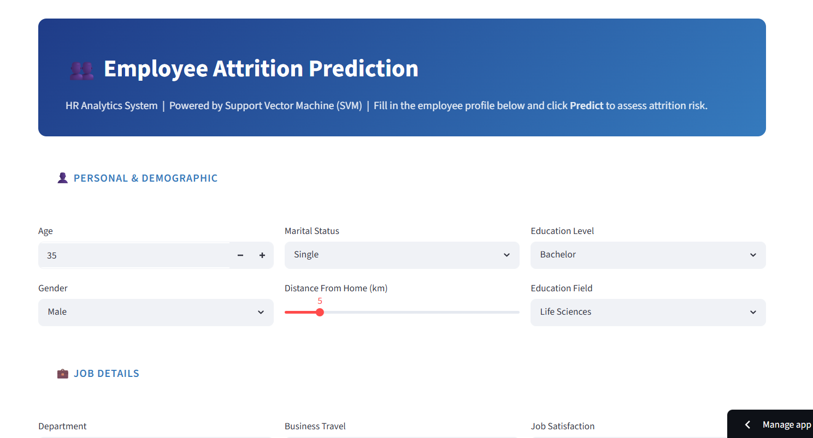
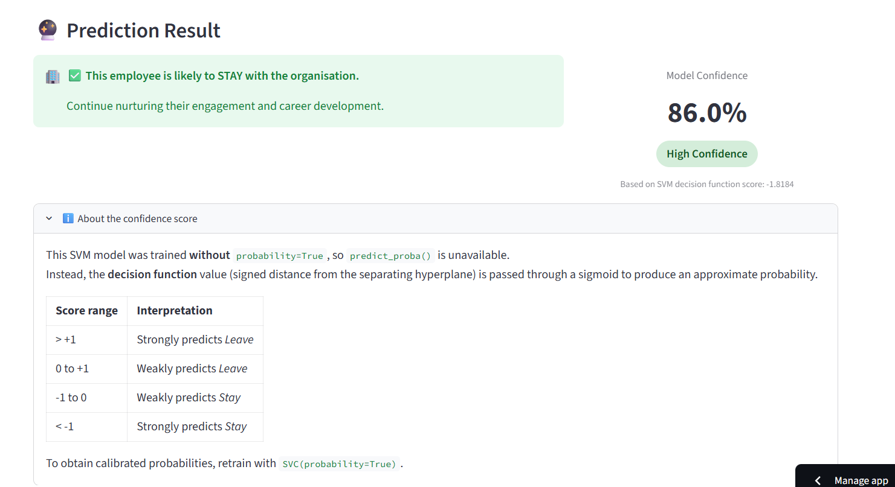

# Employee Attrition Prediction & HR Analytics System


An end-to-end Machine Learning project that predicts whether an employee is likely to leave an organization using HR analytics data. This project covers the complete machine learning workflow including data preprocessing, exploratory data analysis (EDA), feature engineering, model training, model comparison, hyperparameter tuning, and deployment using Streamlit.

---

# Table of Contents

- [Live Demo](#live-demo)
- [Application Preview](#application-preview)
- [Project Overview](#project-overview)
- [Dataset](#dataset)
- [Features](#features)
- [Machine Learning Workflow](#machine-learning-workflow)
- [Models Used](#models-used)
- [Model Performance](#model-performance)
- [Final Model](#final-model)
- [Technologies Used](#technologies-used)
- [Project Structure](#project-structure)
- [Installation](#installation)
- [Future Improvements](#future-improvements)
- [Author](#author)
- [License](#license)

---

# Live Demo

### 🌐 Application

https://employee-attrition-predictor-harsh.streamlit.app/

---

# Application Preview

## Home Page



---

## Model Details


---

## Prediction Result



---

# Project Overview

Employee attrition is one of the biggest challenges faced by organizations. Predicting employee turnover allows HR departments to identify employees who are at risk of leaving and take proactive measures to improve employee retention.

This project uses the IBM HR Analytics dataset to build and compare multiple machine learning classification models. After evaluating different algorithms and performing hyperparameter tuning, the best-performing model was selected and deployed as an interactive Streamlit web application.

---

# Dataset

**Dataset:** IBM HR Analytics Employee Attrition & Performance Dataset

- Total Records: **1,470**
- Target Variable: **Attrition (Yes / No)**

The dataset includes employee demographic information, salary details, work experience, overtime, job satisfaction, work-life balance, department information, and several HR-related features used to predict employee attrition.

---

# Features

- Complete End-to-End Machine Learning Pipeline
- Data Cleaning & Preprocessing
- Exploratory Data Analysis (EDA)
- Feature Engineering
- Label Encoding & One-Hot Encoding
- Feature Scaling using StandardScaler
- Multiple Machine Learning Models
- Cross Validation
- Hyperparameter Tuning using GridSearchCV
- Model Comparison
- Model Serialization using Pickle
- Interactive Streamlit Web Application

---

# Machine Learning Workflow

1. Data Collection
2. Data Cleaning
3. Exploratory Data Analysis (EDA)
4. Feature Engineering
5. Data Encoding
6. Feature Scaling
7. Model Training
8. Model Comparison
9. Hyperparameter Tuning
10. Model Evaluation
11. Model Saving
12. Streamlit Deployment

---

# Models Used

- Logistic Regression
- K-Nearest Neighbors (KNN)
- Support Vector Machine (SVM)
- Gaussian Naive Bayes
- Decision Tree
- Random Forest
- AdaBoost
- Gradient Boosting
- XGBoost
- Stacking Classifier

---

# Model Performance

| Model | Accuracy |
|--------|----------|
| Logistic Regression | 87.8% |
| K-Nearest Neighbors | 88.1% |
| **Support Vector Machine** | **89.8%** |
| Gaussian Naive Bayes | 79.3% |
| Decision Tree | 74.8% |
| Random Forest | 87.4% |
| AdaBoost | 88.4% |
| Gradient Boosting | 87.1% |
| XGBoost | 86.1% |
| Stacking Classifier | 83.1% |

---

# Final Model

## Support Vector Machine (SVM)

```python
C = 0.1
kernel = "linear"
gamma = "scale"
```

---

# Technologies Used

- Python
- Pandas
- NumPy
- Scikit-learn
- XGBoost
- Streamlit
- Matplotlib
- Seaborn
- Pickle

---

# Project Structure

```text
C:.
│   README.md
│
├───data
│       cleaned_employee_attrition.csv
│       encoded_employee_attrition.csv
│       WA_Fn-UseC_-HR-Employee-Attrition.csv
│
├───Final App
│       app.py
│
├───models
│       employee_attrition_scaler.pkl
│       employee_attrition_svm.pkl
│
├───Notebook
│       Employee Attrition Prediction & HR Analytics System.ipynb
│
└───screenshots
        Home.png
        Model Details.png
        Output.png
```

---


# Future Improvements

- SHAP Explainability
- Feature Importance Visualization
- Employee Risk Score
- HR Recommendation System
- Docker Support
- Cloud Deployment
- REST API Integration

---

# Author

## Rohit Jha

**Aspiring Artificial Intelligence Engineer**

- LinkedIn: https://www.linkedin.com/in/rohit-jha-ai/

If you found this project useful, consider giving it a ⭐ on GitHub.

---

# License

This project is licensed under the MIT License.