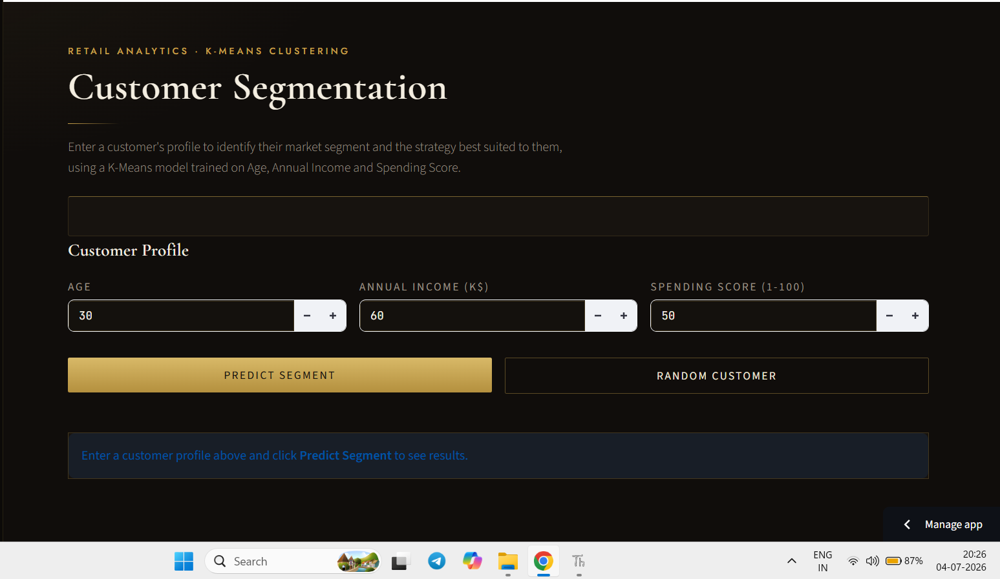
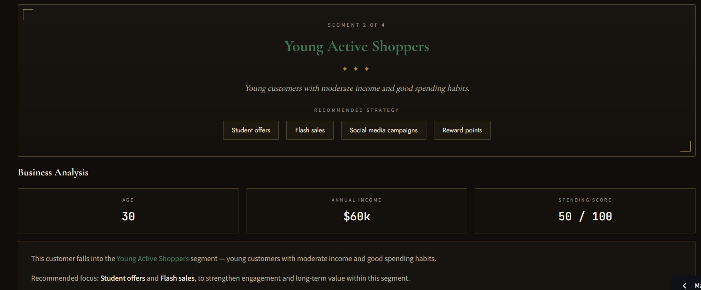
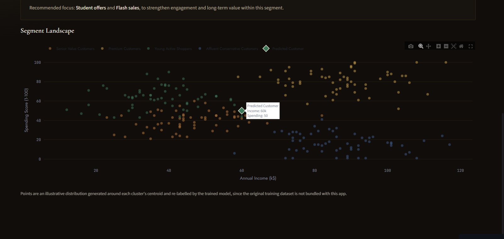

# Retail Customer Segmentation using K-Means Clustering


## Overview

This project uses **K-Means Clustering** to segment retail customers based on their purchasing behaviour. Customers are grouped using **Age**, **Annual Income**, and **Spending Score**, helping businesses identify valuable customer segments and design targeted marketing strategies.

The repository also includes a modern **Streamlit dashboard** for real-time customer segmentation.

---

## Business Problem

Retail businesses often use the same marketing strategy for every customer. This project identifies distinct customer groups so businesses can:

- Improve targeted marketing
- Increase customer retention
- Identify high-value customers
- Personalize promotional campaigns

---

## Dataset

Dataset: **Mall_Customers.csv**

Features used:

- Age
- Annual Income (k$)
- Spending Score (1-100)

---

## Technologies

- Python
- Pandas
- NumPy
- Matplotlib
- Seaborn
- Plotly
- Scikit-Learn
- Streamlit

---

## Machine Learning Workflow

1. Data Cleaning
2. Exploratory Data Analysis
3. Label Encoding
4. Feature Scaling using StandardScaler
5. Elbow Method
6. K-Means Clustering
7. Cluster Analysis
8. Business Recommendations

---

## Customer Segments

| Cluster | Segment | Strategy |
|---------|---------|----------|
| 0 | Senior Value Customers | Loyalty rewards and value offers |
| 1 | Premium Customers | VIP services and exclusive rewards |
| 2 | Young Active Shoppers | Student offers and social media campaigns |
| 3 | Affluent Conservative Customers | Personalized luxury promotions |

---

## Streamlit Dashboard

Features:

- Interactive customer prediction
- Business recommendations
- Plotly visualization
- Random customer generator
- Responsive UI

---

## Screenshots

### Home



### Dashboard



### Visualization



---

## Project Structure

```text
Retail-Customer-Segmentation/
│
├── data/
├── models/
├── Final App/
├── Notebook/
├── Graphs/
├── screenshots/
├── requirements.txt
└── README.md
```

---

## Installation

```bash
git clone <repository-url>

cd Retail-Customer-Segmentation

pip install -r requirements.txt

streamlit run "Final App/app.py"
```

---

## Results

- Four meaningful customer segments identified
- Business-driven customer insights
- Interactive prediction dashboard
- Segment-specific recommendations

---

## Future Improvements

- CSV upload support
- Additional clustering algorithms
- PCA visualization
- Cloud deployment
- Downloadable reports

---

## Live Demo

**Streamlit App**

https://customer-clustering-dashboard.streamlit.app/

---

## Connect

**LinkedIn**

https://www.linkedin.com/in/rohit-jha-ai/

**GitHub**

https://github.com/Rohit-coder-py
---

## Author

**Rohit Jha**

Aspiring AI Engineer | Machine Learning | Data Science

If you found this project useful, consider giving it a star on GitHub.
