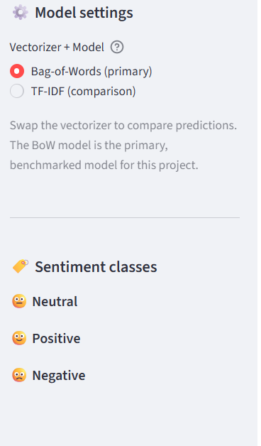
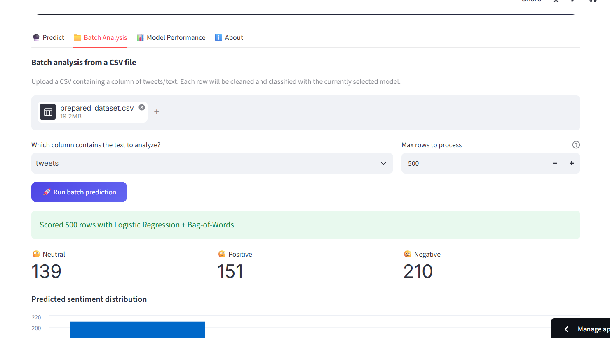
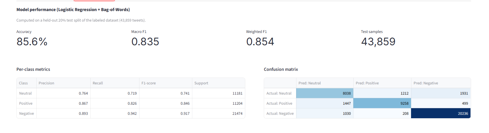
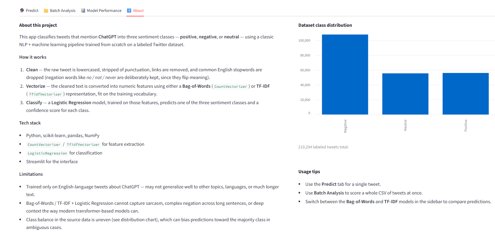

<div align="center">

# 💬 ChatGPT Sentiment Analysis

**Classifying public sentiment toward ChatGPT from tweets — classic NLP meets a polished Streamlit UI.**


</div>


> Try Live App : https://chatgpt-sentiment-analysis-nlp-machine-learning.streamlit.app/ 

---

## 🎥 Demo Video

https://github.com/user-attachments/assets/9b0d09fa-e273-4471-8499-e37e67d9d576

---

## 📑 Table of Contents

- [🔥 Project Overview](#-project-overview)
- [⚠️ Disclaimer](#️-disclaimer)
- [🎯 Project Goal](#-project-goal)
- [🧠 Model / Architecture](#-model--architecture)
- [📊 Results](#-results)
- [🛠️ Technologies Used](#️-technologies-used)
- [📂 Project Structure](#-project-structure)
- [🚀 How to Run](#-how-to-run)
- [🌐 Live Demo](#-live-demo)
- [📸 Screenshots](#-screenshots)
- [🧩 Limitations](#-limitations)

---

## 🔥 Project Overview

A Streamlit application that classifies tweets about **ChatGPT** as **positive**, **negative**, or **neutral**, built on a classic NLP + machine learning pipeline (Bag-of-Words / TF-IDF + Logistic Regression). It ships with a single-tweet predictor, a batch CSV analyzer, a live model-performance dashboard, and a side-by-side comparison between the Bag-of-Words and TF-IDF models — all served from pre-trained artifacts, so nothing needs to be retrained to run it.

## ⚠️ Disclaimer

This project is developed for **educational and demonstration purposes** to
show how traditional NLP and machine learning techniques can be used for
sentiment classification.

The model achieves **85.6% test accuracy** on the held-out test dataset, but
this does not guarantee correct predictions for every individual sentence.
Some inputs — especially very short, ambiguous, sarcastic, or context-dependent
texts — may be misclassified.

The model is based on **Bag-of-Words / TF-IDF features with Logistic
Regression** and does not have the deep contextual understanding of modern
transformer-based language models.

Therefore, predictions and confidence scores should be treated as **model
estimates rather than definitive judgments of sentiment**.

## 🎯 Project Goal

Build a complete, deployable sentiment-analysis pipeline for a single, well-scoped domain (ChatGPT-related tweets) — from raw text cleaning through classical feature engineering and classification, to a production-style web app with batch scoring and a transparent, inspectable evaluation dashboard.

## 🧠 Model / Architecture

Trained in [`notebooks/ChatGPT Sentiment Analysis using NLP & Machine Learning.ipynb`](<notebooks/ChatGPT Sentiment Analysis using NLP & Machine Learning.ipynb>) on ~44K labeled tweets (`neutral`, `good`, `bad`):

1. **Text cleaning** — lowercase → strip punctuation → remove URLs → remove English stopwords, while keeping negation words `no / not / nor / never` since they flip sentiment meaning.
2. **Feature extraction** — two parallel vectorizers, each fit on the cleaned training tweets:
   - `CountVectorizer` → **Bag-of-Words**
   - `TfidfVectorizer` → **TF-IDF**
3. **Classification** — `LogisticRegression` trained separately on each feature set.

| Component | File |
| --- | --- |
| Bag-of-Words vectorizer | `models/bow_vectorizer.pkl` |
| Bag-of-Words classifier (primary / benchmarked) | `models/logistic_model_bow.pkl` |
| TF-IDF vectorizer | `models/tfidf_vectorizer.pkl` |
| TF-IDF classifier | `models/logistic_model_tfidf.pkl` |
| Label mapping | `models/label_mapping.json` → `{0: neutral, 1: good, 2: bad}` |

The **Bag-of-Words** model is the primary, benchmarked model — its metrics are what's reported below and inside the app's dashboard tab.

## 📊 Results

Evaluated on a held-out test split of **43,859** tweets (`models/eval_report.json`):

| Metric | Score |
| --- | --- |
| **Accuracy** | **85.6%** |
| Macro F1 | 0.835 |
| Weighted F1 | 0.854 |

| Class | Precision | Recall | F1-score | Support |
| --- | --- | --- | --- | --- |
| Neutral | 0.764 | 0.719 | 0.741 | 11,181 |
| Good (positive) | 0.867 | 0.826 | 0.846 | 11,204 |
| Bad (negative) | 0.893 | 0.942 | 0.917 | 21,474 |

The confusion matrix (`models/confusion_matrix.npy`) is rendered live in the app's dashboard tab. As the disclaimer above notes, an 85–86% accuracy on a 3-class problem still leaves a meaningful share of tweets — particularly short, sarcastic, or neutral-leaning ones — misclassified; treat outputs as estimates, not ground truth.

## 🛠️ Technologies Used

- **Python**
- **scikit-learn** — `CountVectorizer`, `TfidfVectorizer`, `LogisticRegression`, evaluation metrics
- **pandas** & **NumPy** — data handling and batch scoring
- **Streamlit** — web app framework and deployment
- **Matplotlib** — confusion matrix / dashboard visuals
- **Jupyter Notebook** — training and evaluation workflow

## 📂 Project Structure

```text
ChatGPT-Sentiment-Analysis/
├── app.py                      # Streamlit entry point
├── requirements.txt
├── utils/
│   ├── preprocessing.py        # exact training-time text cleaning pipeline
│   └── model_loader.py         # cached model/vectorizer/report loading
├── models/
│   ├── bow_vectorizer.pkl
│   ├── logistic_model_bow.pkl      # primary / benchmarked model
│   ├── tfidf_vectorizer.pkl
│   ├── logistic_model_tfidf.pkl
│   ├── label_mapping.json
│   ├── eval_report.json
│   └── confusion_matrix.npy
├── data/
│   ├── file.csv                 # raw labeled tweets
│   └── prepared_dataset.csv     # cleaned tweets used for training
├── notebooks/
│   └── ChatGPT Sentiment Analysis using NLP & Machine Learning.ipynb
└── preview/
    ├── demo.mp4                 # demo video
    ├── menu.png                 # screenshot
    ├── batch-upload.png         # screenshot
    ├── model-info.png           # screenshot
    └── about.png                # screenshot
```

## 🚀 How to Run

```bash
python -m venv .venv
source .venv/bin/activate        # Windows: .venv\Scripts\activate

pip install -r requirements.txt
```

Then, from the project folder:

```bash
streamlit run app.py
```

The app opens at `http://localhost:8501`. All file paths in `app.py` resolve relative to the script itself, so it works from any working directory.

## 🌐 Live Demo

**Try it here:** https://chatgpt-sentiment-analysis-nlp-machine-learning.streamlit.app/

## 📸 Screenshots

**Menu**



**Batch Upload**



**Model Info**



**About**



## 🧩 Limitations

- Trained only on English-language tweets specifically about ChatGPT; may not generalize to other topics or much longer text.
- Bag-of-Words / TF-IDF + Logistic Regression can't capture sarcasm or deep context the way transformer-based models can.
- The training data's class balance is uneven (the `bad` class has roughly double the support of the other two), which can bias borderline predictions toward the majority class.
