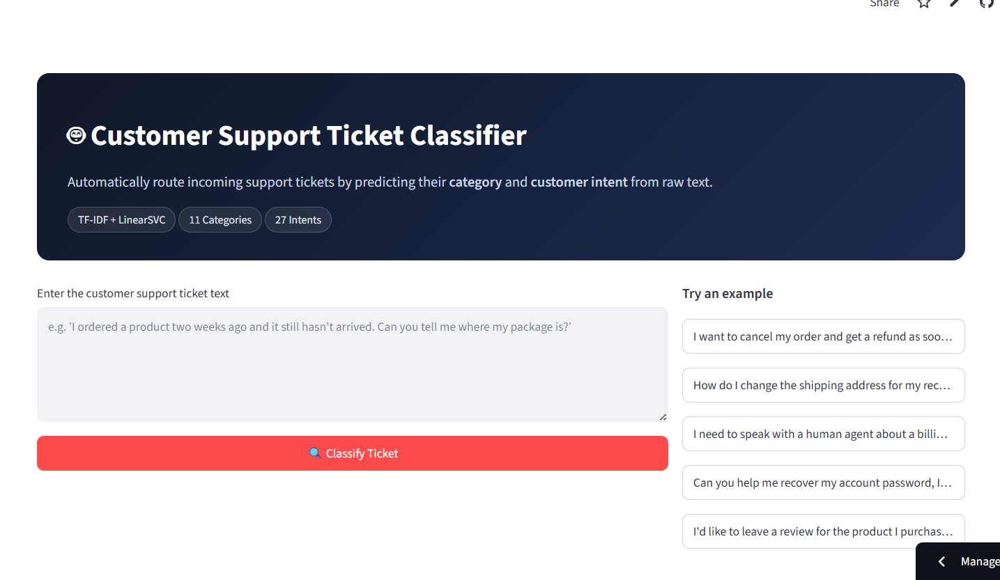
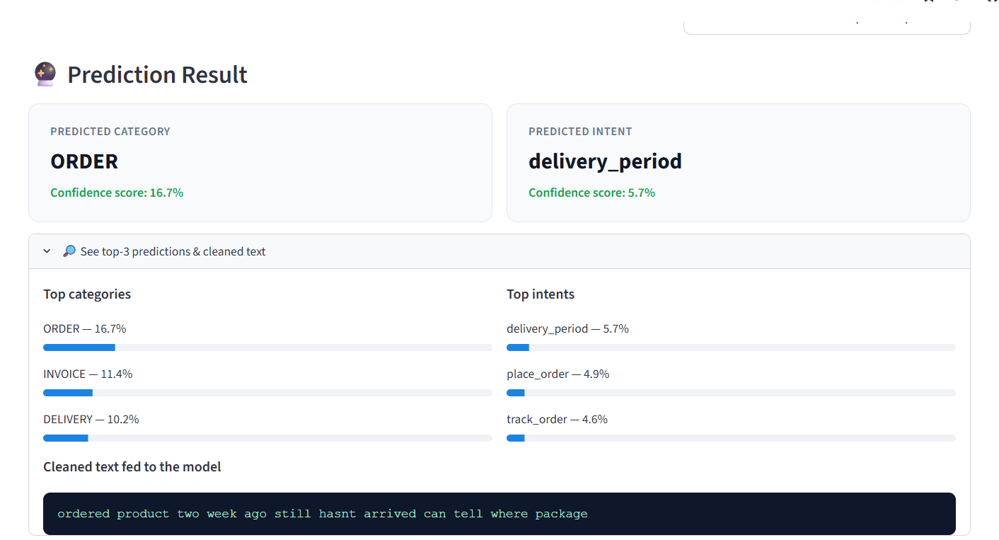
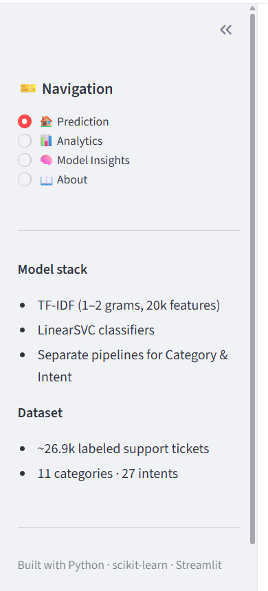

<div align="center">

# 🎫 Customer Support Ticket Classification System

**Automatically routing customer support tickets by category and intent — classical NLP + ML, served through a polished Streamlit dashboard.**


</div>

---

## 📑 Table of Contents

- [🔥 Project Overview](#-project-overview)
- [🎯 Project Goal](#-project-goal)
- [🧠 Model / Architecture](#-model--architecture)
- [📊 Results](#-results)
- [🛠️ Technologies Used](#️-technologies-used)
- [📂 Project Structure](#-project-structure)
- [🚀 How to Run](#-how-to-run)
- [🌐 Live Demo](#-live-demo)
- [📸 Screenshots](#-screenshots)
- [🔮 Future Improvements](#-future-improvements)
- [🧩 Limitations](#-limitations)

---

## 🔥 Project Overview

Support teams receive large volumes of free-text tickets that need to be triaged and routed to the right queue. This project trains two text classifiers on the same customer message — one for ticket **category** (the department, e.g. `ORDER`, `REFUND`, `ACCOUNT`) and one for ticket **intent** (the specific request, e.g. `cancel_order`, `track_refund`) — and wraps both in an interactive Streamlit app for real-time predictions, dataset analytics, and full model-comparison insight, with no deep learning involved anywhere in the pipeline.

## 🎯 Project Goal

Given the raw text of a customer support message, predict:

1. **Category** — the broad department/topic (**11 classes**)
2. **Intent** — the specific customer request (**27 classes**)

so tickets can be automatically routed without a human reading every one — while keeping the entire pipeline classical NLP + machine learning (no transformers, no deep learning).

## 🧠 Model / Architecture

Trained in [`notebook/Customer_Support_Ticket_Classification_System.ipynb`](notebook/Customer_Support_Ticket_Classification_System.ipynb) on **~26.9K** labeled tickets (`data/customer_dataset_raw.csv`, columns: `flags`, `instruction`, `category`, `intent`, `response`).

```text
Raw ticket text
      │
      ▼
Text cleaning (lowercase, remove placeholders/URLs/punctuation/digits,
                stopword removal, lemmatization)
      │
      ▼
TF-IDF vectorization (1–2 grams, 20,000 max features)
      │
      ▼
LinearSVC classifier  ──►  separate model for Category and for Intent
      │
      ▼
Label decoding → Category / Intent prediction
```

**Models tested:** two feature representations (**Bag-of-Words**, **TF-IDF**) × three classifiers (**Multinomial Naive Bayes**, **Logistic Regression**, **LinearSVC**), evaluated for *both* targets — **12 combinations** in total (`models/model_comparison.csv`, `graphs/model_comparison.png`).

**Final model — for both targets:** TF-IDF (1–2 grams, 20,000 max features) + LinearSVC, selected on validation accuracy and macro-F1.

| Target | Classes |
| --- | --- |
| Category (11) | ACCOUNT, CANCEL, CONTACT, DELIVERY, FEEDBACK, INVOICE, ORDER, PAYMENT, REFUND, SHIPPING, SUBSCRIPTION |
| Intent (27) | see `models/intent_label_mapping.json` |

## 📊 Results

Held-out test split, **2,464** tickets:

| Target | Accuracy | Macro-F1 | Weighted-F1 |
| --- | --- | --- | --- |
| **Category** | **99.72%** | 99.70% | 99.72% |
| **Intent** | **99.15%** | 99.05% | 99.15% |

<details>
<summary><strong>Full 12-way model comparison</strong> (accuracy / macro-F1 / weighted-F1)</summary>

| Target | Features | Model | Accuracy | Macro-F1 | Weighted-F1 |
| --- | --- | --- | --- | --- | --- |
| category | BOW | MultinomialNB | 0.9931 | 0.9939 | 0.9931 |
| category | BOW | LogisticRegression | 0.9939 | 0.9940 | 0.9939 |
| category | BOW | LinearSVC | 0.9935 | 0.9935 | 0.9935 |
| category | TF-IDF | MultinomialNB | 0.9927 | 0.9933 | 0.9927 |
| category | TF-IDF | LogisticRegression | 0.9935 | 0.9940 | 0.9935 |
| category | TF-IDF | **LinearSVC ✅** | **0.9959** | **0.9963** | **0.9959** |
| intent | BOW | MultinomialNB | 0.9825 | 0.9823 | 0.9825 |
| intent | BOW | LogisticRegression | 0.9838 | 0.9827 | 0.9838 |
| intent | BOW | LinearSVC | 0.9874 | 0.9866 | 0.9875 |
| intent | TF-IDF | MultinomialNB | 0.9813 | 0.9811 | 0.9813 |
| intent | TF-IDF | LogisticRegression | 0.9870 | 0.9864 | 0.9870 |
| intent | TF-IDF | **LinearSVC ✅** | **0.9898** | **0.9893** | **0.9899** |

</details>

Full per-class precision/recall/F1 is in `models/category_eval_report.json` and `models/intent_eval_report.json`; confusion matrices are in `graphs/category_confusion_matrix.png` and `graphs/intent_confusion_matrix.png`.

> ⚠️ **A note on the near-perfect scores:** this dataset's tickets are template-generated per intent, so vocabulary is highly separable between classes — that's why classical TF-IDF + LinearSVC reaches 99%+ here. Real-world, human-written support tickets are noisier (typos, mixed intents, slang, multilingual text) and would likely score meaningfully lower; treat these numbers as a ceiling for this specific dataset, not a general benchmark.

## 🛠️ Technologies Used

- **Python**
- **scikit-learn** — `TfidfVectorizer`, `CountVectorizer`, `LinearSVC`, `LogisticRegression`, `MultinomialNB`, evaluation metrics
- **NLTK** — stopword removal, lemmatization
- **pandas** & **NumPy** — data handling
- **Matplotlib** & **Seaborn** — EDA and evaluation visualizations
- **Streamlit** — web app framework and deployment
- **joblib** — model/pipeline persistence
- **Jupyter Notebook** — training and evaluation workflow

## 📂 Project Structure

```text
Customer Support Ticket Classification System/
├── app.py                              # Streamlit application (entry point)
├── requirements.txt
├── README.md
├── graphs/                             # saved visualizations (300 DPI)
│   ├── category_distribution.png
│   ├── intent_distribution.png
│   ├── text_length_distribution.png
│   ├── model_comparison.png
│   ├── category_confusion_matrix.png
│   ├── intent_confusion_matrix.png
│   └── category_f1_scores.png
├── models/
│   ├── category_pipeline.pkl           # TF-IDF + LinearSVC (category)
│   ├── intent_pipeline.pkl             # TF-IDF + LinearSVC (intent)
│   ├── category_label_encoder.pkl
│   ├── intent_label_encoder.pkl
│   ├── category_label_mapping.json
│   ├── intent_label_mapping.json
│   ├── category_eval_report.json
│   ├── intent_eval_report.json
│   ├── category_confusion_matrix.npy
│   ├── intent_confusion_matrix.npy
│   └── model_comparison.csv
├── data/
│   └── customer_dataset_raw.csv
└── notebook/
    └── Customer_Support_Ticket_Classification_System.ipynb
```

## 🚀 How to Run

```bash
python -m venv .venv
source .venv/bin/activate        # Windows: .venv\Scripts\activate

pip install -r requirements.txt
```

Then, from the project folder:

```bash
streamlit run app.py
```

The app opens at `http://localhost:8501` with four sections:

- **🏠 Prediction** — enter ticket text and get an instant category + intent prediction with top-3 confidence breakdown
- **📊 Analytics** — dataset-level visual insights (category/intent distribution, text length)
- **🧠 Model Insights** — full model comparison, confusion matrices, classification reports
- **📖 About** — project background, methodology, and limitations

## 🌐 Live Demo

**Try it here:** [customer-support-ticket-classification-system-nlp.streamlit.app](https://customer-support-ticket-classification-system-nlp.streamlit.app/)

## 📸 Screenshots

**Homepage**



**Sample Prediction**



**Model Insights**



## 🔮 Future Improvements

- Add a transformer-based model (e.g. DistilBERT) as a comparison baseline
- Support multi-label / multi-intent tickets
- Batch classification via CSV upload
- Active-learning loop for continuously improving on misrouted tickets

## 🧩 Limitations

- The dataset's tickets are template-generated per intent, so the near-perfect scores above reflect a highly separable vocabulary rather than real-world messiness — see the note under [Results](#-results).
- TF-IDF + LinearSVC has no deep contextual understanding and can't handle tickets that mix multiple intents in one message.
- Trained only on English-language tickets; won't generalize to other languages without retraining.