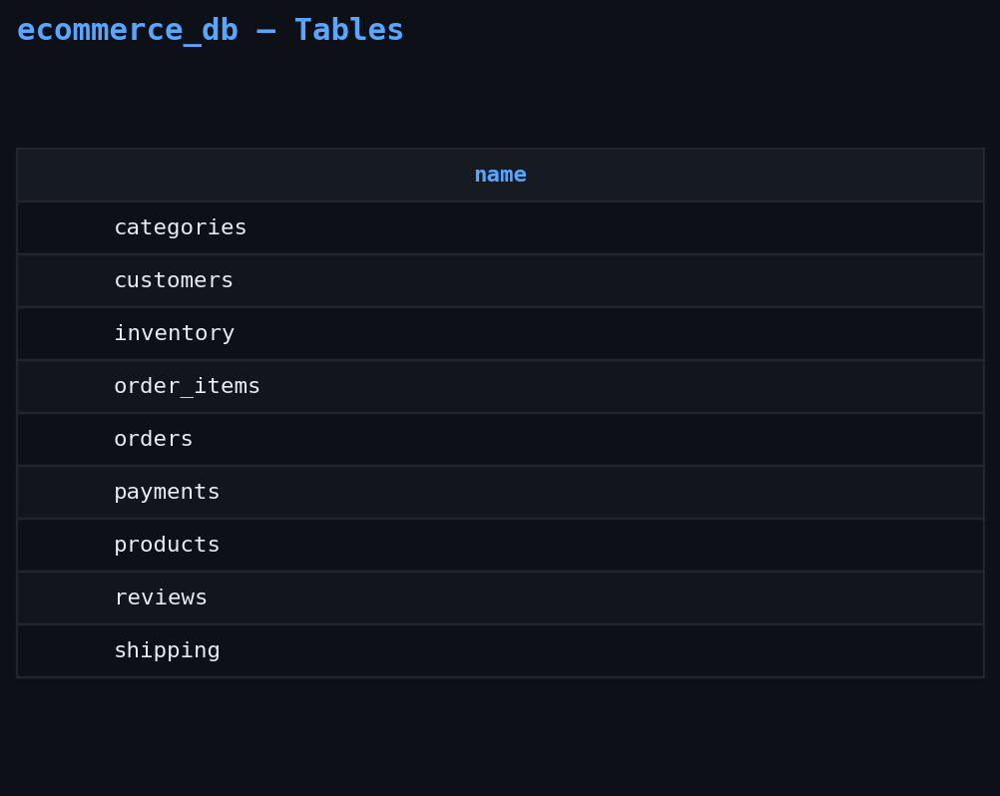
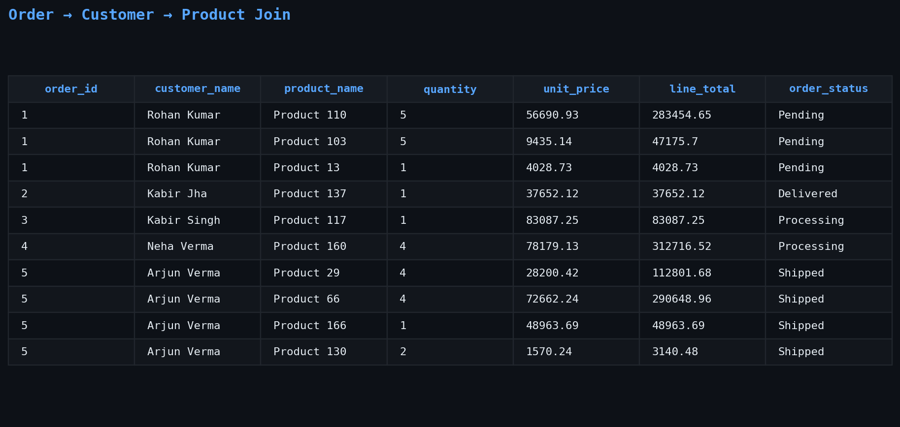
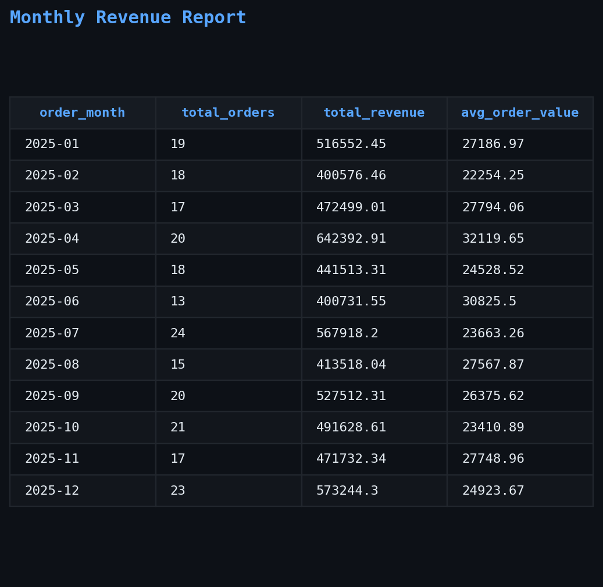
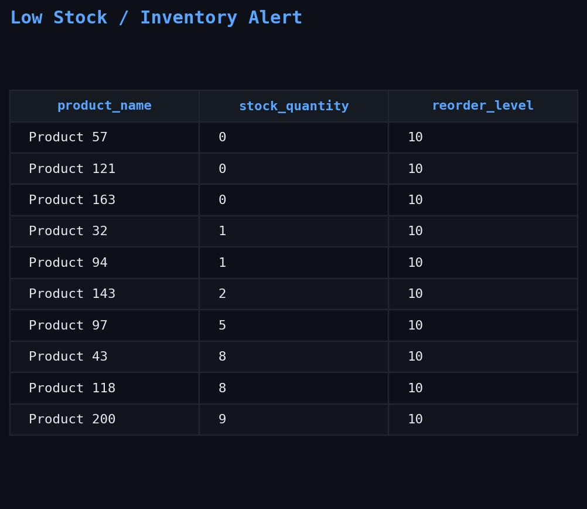
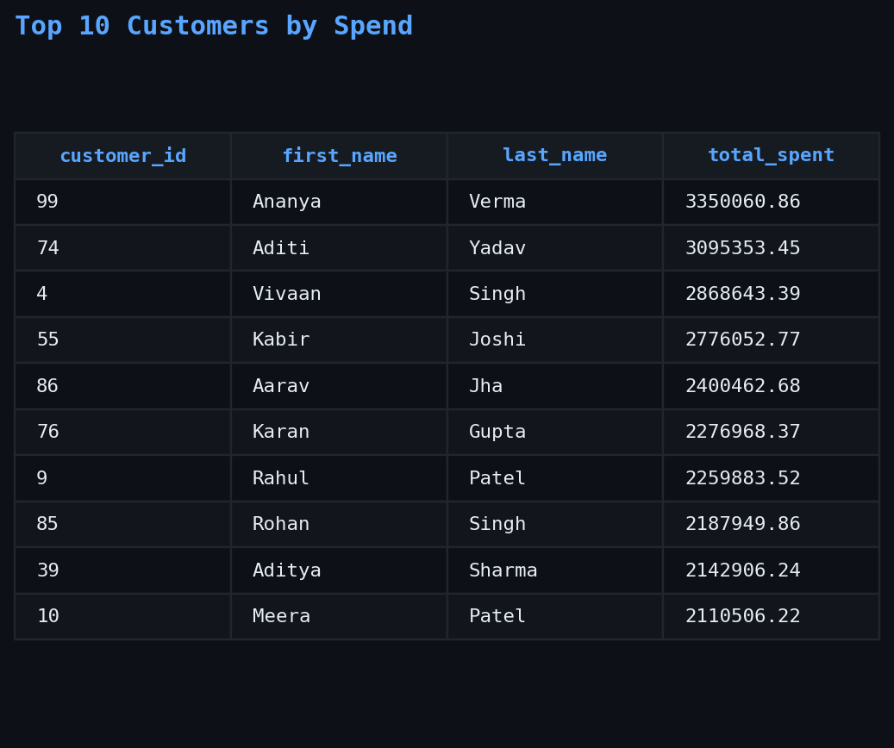
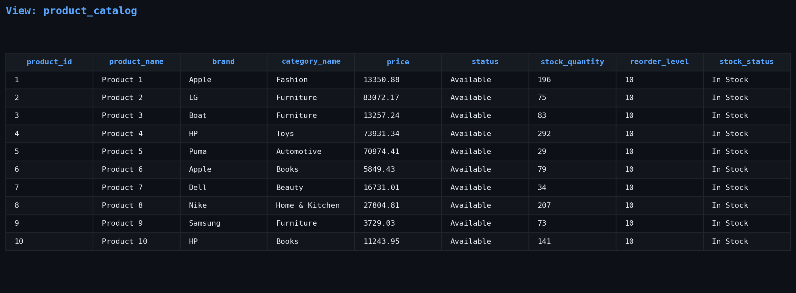
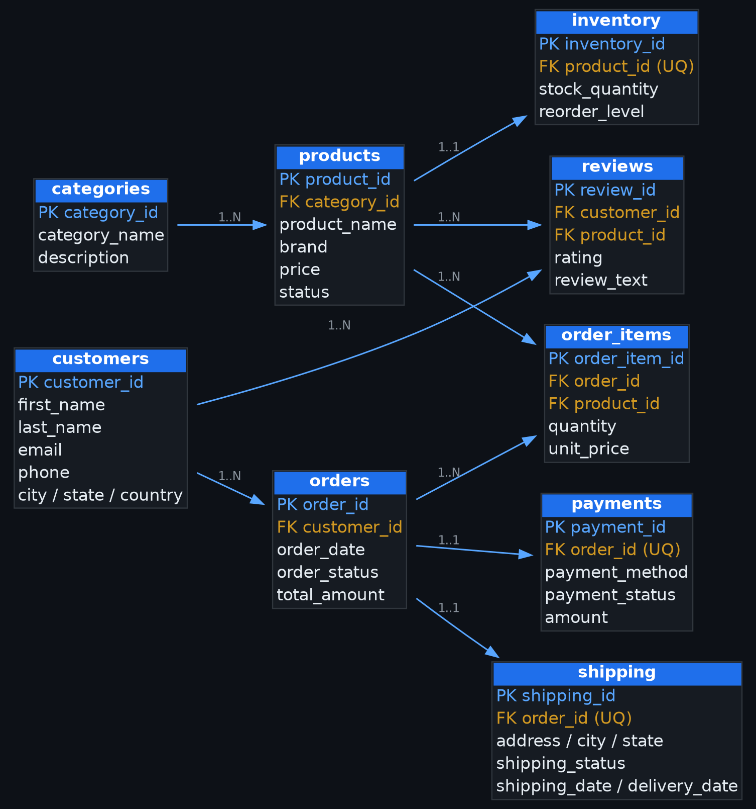
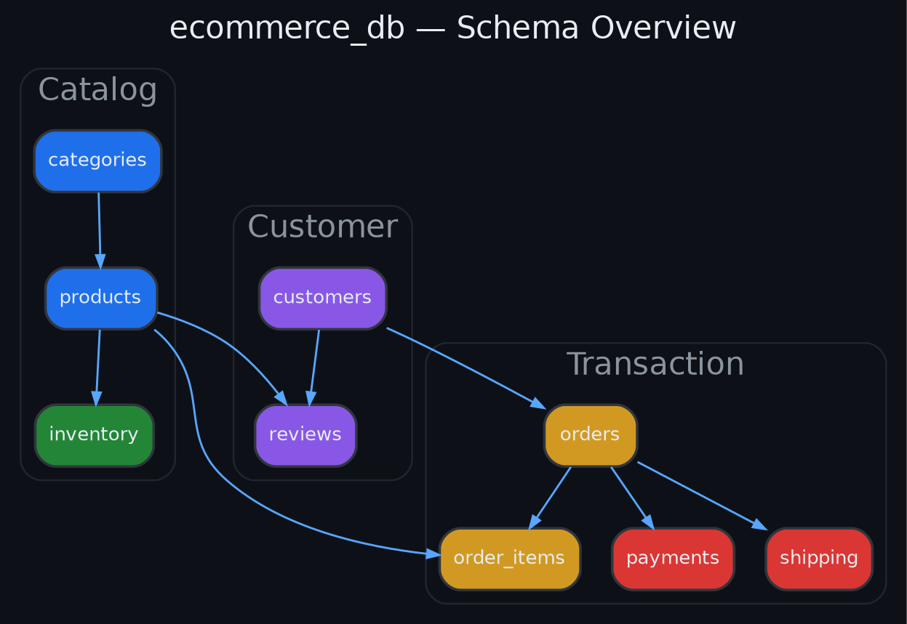

# E-Commerce Database Management System


**𝗜𝗻𝘀𝗽𝗶𝗿𝗲𝗱 𝗯𝘆 𝘁𝗵𝗲 𝗯𝗮𝗰𝗸𝗲𝗻𝗱 𝗱𝗮𝘁𝗮𝗯𝗮𝘀𝗲𝘀 𝘂𝘀𝗲𝗱 𝗯𝘆 Amazon, Flipkart, Walmart,
eBay, and Shopify.**

> **This is an educational clone created for learning SQL and relational
> database design. It is not affiliated with or derived from any of the
> companies mentioned above.**

------------------------------------------------------------------------

# Table of Contents

-   [Project Overview](#project-overview)
-   [Features](#features)
-   [Tech Stack](#tech-stack)
-   [Project Structure](#project-structure)
-   [Database Tables](#database-tables)
-   [Relationships](#relationships)
-   [SQL Concepts](#sql-concepts)
-   [Reports](#reports)
-   [Screenshots](#screenshots)
-   [Database Design](#database-design)
-   [How to Run](#how-to-run)
-   [Future Improvements](#future-improvements)
-   [Author](#author)

------------------------------------------------------------------------

# Project Overview

This project simulates the backend database of a modern e-commerce
platform using PostgreSQL.

**𝗞𝗲𝘆 𝗢𝗯𝗷𝗲𝗰𝘁𝗶𝘃𝗲𝘀**

➜ Design a normalized relational database\
➜ Maintain data integrity using constraints\
➜ Demonstrate real-world SQL queries\
➜ Build reports using Views and JOINs\
➜ Organize realistic business data

------------------------------------------------------------------------

# Features

⭐ Normalized Database Design (3NF)

⭐ Primary & Foreign Keys

⭐ CHECK & UNIQUE Constraints

⭐ Inventory Management

⭐ Order Management

⭐ Payment Tracking

⭐ Product Reviews

⭐ Revenue Reporting

⭐ Complex JOIN Queries

⭐ SQL Views

⭐ Business Reports

------------------------------------------------------------------------

# Tech Stack

-   PostgreSQL
-   SQL
-   pgAdmin

------------------------------------------------------------------------

# Project Structure

``` text
E-Commerce-Database-Management-System/
│
├── README.md
├── database/
│   ├── 01_create_database.sql
│   ├── 02_create_tables.sql
│   ├── 03_insert_sample_data.sql
│   ├── 04_queries.sql
│   └── 05_views.sql
├── diagrams/
│   ├── er_diagram.png
│   └── schema.png
├── docs/
│   ├── database_design.md
│   └── project_report.pdf
└── screenshots/
    ├── inventory_report.png
    ├── joins.png
    ├── revenue_report.png
    ├── tables.png
    ├── top_customers.png
    └── views.png
```

------------------------------------------------------------------------

# Database Tables

  Table         Purpose
  ------------- -----------------------------
  Customers     Stores customer information
  Categories    Product categories
  Suppliers     Supplier information
  Products      Product catalog
  Inventory     Stock management
  Orders        Customer orders
  Order_Items   Products within orders
  Payments      Payment records
  Reviews       Customer reviews

------------------------------------------------------------------------

# Relationships

➜ One Customer → Many Orders

➜ One Customer → Many Reviews

➜ One Category → Many Products

➜ One Supplier → Many Products

➜ One Product → One Inventory Record

➜ One Product → Many Reviews

➜ One Order → Many Order Items

➜ One Product → Many Order Items

------------------------------------------------------------------------

# SQL Concepts

-   CREATE DATABASE
-   CREATE TABLE
-   Constraints
-   Primary Keys
-   Foreign Keys
-   INSERT
-   INNER JOIN
-   LEFT JOIN
-   RIGHT JOIN
-   Aggregate Functions
-   GROUP BY
-   HAVING
-   ORDER BY
-   Views

------------------------------------------------------------------------

# Reports

-   Revenue Report
-   Inventory Report
-   Customer Order Report
-   Top Customers
-   Product Performance
-   JOIN Demonstrations

------------------------------------------------------------------------

# Screenshots

## Tables



## JOIN Queries



## Revenue Report



## Inventory Report



## Top Customers



## Views



------------------------------------------------------------------------

# Database Design

## ER Diagram



## Database Schema



------------------------------------------------------------------------

# How to Run

1.  Clone this repository.
2.  Open PostgreSQL and pgAdmin.
3.  Execute the SQL files in the following order:

``` text
01_create_database.sql
02_create_tables.sql
03_insert_sample_data.sql
04_queries.sql
05_views.sql
```

4.  Explore the reports and views.

------------------------------------------------------------------------

# Future Improvements

-   Stored Procedures
-   Triggers
-   Index Optimization
-   Transactions
-   User Roles & Permissions

------------------------------------------------------------------------

# Author

**Rohit Jha**

Aspiring AI Engineer \| Python \| SQL \| Machine Learning \| PostgreSQL

GitHub: **Rohit-coder-py**
