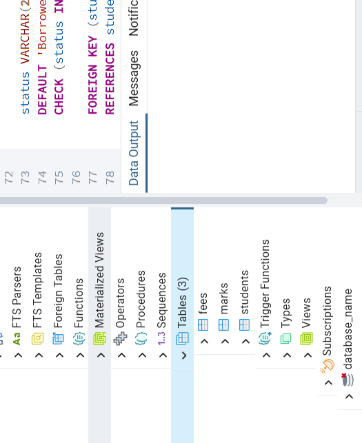
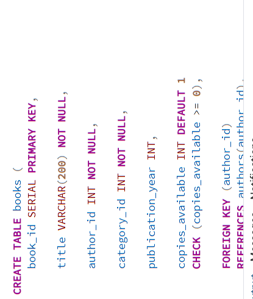
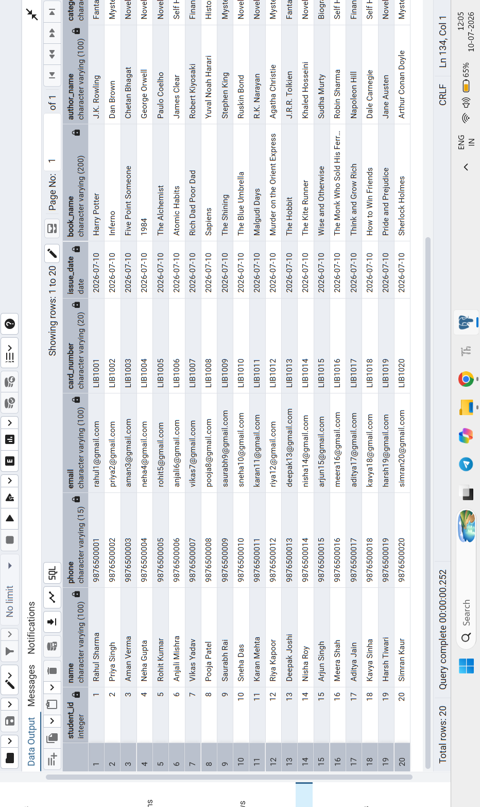

# 📚 Library Management System


A beginner-friendly **PostgreSQL** project that manages students, books,
library cards, authors, categories, and borrowing records using a
relational database.

## ✨ Features

-   Student & Library Card Management
-   Book, Author & Category Management
-   Borrow & Return Records
-   SQL Queries & Views
-   ER Diagram
-   Sample Dataset

## 🛠️ Tech Stack

-   PostgreSQL
-   SQL
-   pgAdmin

## 📂 Project Structure

``` text
database/
├── 01_create_database.sql
├── 02_create_tables.sql
├── 03_insert_sample_data.sql
├── 04_queries.sql
└── 05_views.sql
```

## 🗺️ ER Diagram


## 📸 Screenshots

### Tables



### Relationships



### Sample Queries



## 🚀 Run the Project

Execute the SQL files in order:

1.  Create Database
2.  Create Tables
3.  Insert Sample Data
4.  Run Queries
5.  Create Views

## 👨‍💻 Author

**Rohit Jha**

GitHub: https://github.com/Rohit-coder-py
